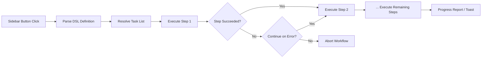

import TLDR from '@site/src/components/TLDR';

# 工作流

<TLDR>
**Notemd 工作流可将多个任务整合为一次点击即可完成的操作。** 可通过简单的 DSL 定义类似 `add-links > extract-concepts > research > diagram` 的流程顺序。这些工作流会以侧边栏按钮的形式出现，可在当前笔记或文件夹中执行整个流程。系统预置了多种工作流；用户也可在设置中创建自定义工作流。每个步骤都使用独立的任务模型配置。

这是[Obsidian AI知识管理指南](/docs/pillar-ai-knowledge)的一部分。
</TLDR>

## 概览

工作流消除了逐个执行任务的繁琐流程。无需右键点击四次来添加链接、提取概念、查询陌生术语以及生成图表，只需按下侧边栏上的一个按钮，整个流程就会自动运行。Notemd负责处理任务顺序、错误传播以及进度报告。

工作流是通过一种轻量级的领域特定语言来定义的。它们存储在设置中，会以可点击按钮的形式出现在 Obsidian 侧边栏中，并且可以应用于当前笔记或整个文件夹。

## 它是如何工作的？

### 工作流执行管道



1. **Parse** -- 该 DSL 字符串会按照 `>`（或 `>`）被分割成有序的任务标识符列表。
2. **Resolve** -- 每个标识符都对应一个内部命令（add-links、extract-concepts、research、translate、diagram 等）。
3. **执行** -- 各步骤按顺序运行。每一步都会使用其配置的对应任务提供者和模型。
4. **错误处理** -- 如果某个步骤失败，工作流会根据您设定的错误处理策略要么中止，要么继续执行下一步骤。
5. **已完成** -- 提示通知会报告成功状态或列出所有失败的步骤。

### DSL 格式

工作流被定义为以 `>` 分隔的任务标识符序列：

```
process-current-add-links>extract-concepts-current>research-and-summarize
```

**可用任务标识符：**

| 标识符 | 操作 |
|------------|--------|
| `process-current-add-links` | 在当前笔记中添加维基链接 |
| `extract-concepts-current` | 从当前笔记中提取概念 |
| `research-and-summarize` | 研究选定的文本或笔记标题 |
| `process-current-translate` | 翻译活动笔记 |
| `summarize-to-mermaid` | 根据当前笔记生成图表 |
| `generate-from-title` | 根据笔记标题生成内容 |
| `extract-original-text` | 提取原始文本（用于OCR/扫描内容） |

**文件夹级变体**会在标识符名称中将 `current` 替换为 `folder`。

### 预定义工作流与自定义工作流

Notemd 自带针对常见场景的现成工作流：

| 工作流 | 链条 | 用例 |
|----------|-------|----------|
| **一键提取** | 添加链接 > 提取概念 > 研究 | 一次性处理一篇研究论文 |
| **完整流程** | 添加链接 > 提取概念 > 研究 > 绘制图表 | 通过可视化完成完整的知识提取 |
| **翻译 + 链接** | 翻译 > 添加链接 | 翻译并在目标语言中关联相关概念 |

**自定义工作流**是在设置中创建的：

1. 打开**设置** --> **Notemd** --> **工作流**
2. 点击**“添加工作流”**
3. 输入 DSL 链（例如：`process-current-add-links>extract-concepts-current`）
4. 为其设置一个显示名称（例如“快速链接 + 提取”）。
5. 新按钮会立即出现在侧边栏中。

## 配置

| 设置 | 默认值 | 效果 |
|---------|---------|--------|
| `workflows` | 预定义集合 | 工作流定义数组（名称 + DSL） |
| `workflowContinueOnError` | `true` | 如果当前步骤失败，则继续执行下一步。 |
| `workflowShowProgress` | `true` | 在每一步完成之后显示进度提示。 |

### 工作流中的任务级模型

工作流中的每一步都会使用其**独立的**任务专用模型配置。无需在 DSL 本身中指定模型。解析顺序为：

1. 如果 `useMultiModelSettings` 存在，则按任务使用相应的提供者/模型
2. 全局 `activeProvider`，否则

这意味着 `add-links` 可以在 DeepSeek 上运行，而 `research` 则在 GPT-4o 上运行——所有操作都在同一个工作流点击中完成。

## 示例

您刚刚将一篇机器学习论文的 PDF 导入到您的知识库中，现在希望进行完整的知识提取：

1. 打开导入的笔记
2. 点击**“完整流水线”**侧边栏按钮
3. Notemd 执行：
   - **步骤 1**：添加维基链接 -- `[[attention mechanism]]`、`[[transformer]]` 等。
   - **步骤 2**：提取概念——在您的概念文件夹中创建概念笔记
   - **步骤3**：调研——汇总关键术语的网页资料
   - **第4步**：图表生成——创建该论文结构的Mermaid思维导图
4. 大约30秒后，您的笔记将包含链接、概念说明，研究内容也会被添加进去，同时还会保存一个图表文件。

只需一次点击即可完成所有操作。

## 技巧

- **从预定义的工作流开始**——它们涵盖了最常见的模式。只有在需要不同的执行顺序时才进行自定义。
- **启用 `workflowContinueOnError`** -- 图表生成过程中的某个步骤失败不应导致整个流程中止。
- 使用**文件夹工作流**进行批量处理——右键点击文件夹，选择相应的工作流，即可处理所有笔记。
- **清晰地为工作流命名**——侧边栏空间有限。请使用简短且具有明确动作指向的名称，例如“快速提取”或“翻译+链接”。

---

## 后续步骤

- [研究](./research) -- 在将其加入工作流之前，先了解研究步骤的功能
- [Wiki-Links](./wiki-links) -- 大多数工作流中使用的核心链接功能
- [概念说明](./concept-notes) -- 将概念提取作为工作流中的一个步骤
- [批量处理](/docs/advanced/batch-processing) -- 文件夹工作流的并发处理与进度报告功能
