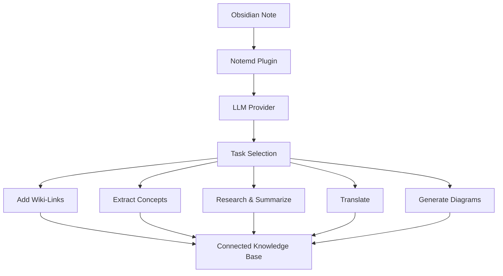

import TLDR from '@site/src/components/TLDR';

# Notemd 介绍

<TLDR>
**Notemd 是写入优先（write-first）的 AI Obsidian 插件。** 不是把结论留在聊天记录里，而是把 wiki-links、概念笔记、研究摘要、翻译和图表直接写入你的 Markdown 库。支持 30+ 个 LLM 提供商，包括 Ollama 离线模式。
</TLDR>

## Notemd 是什么？

Notemd 是一个 Obsidian 社区插件，用 LLM 自动把你的笔记变成结构化、可连接的知识库：

- ✍️ **写入优先** — AI 处理笔记，结果写回 Markdown 文件
- 🔗 **Wiki 链接** — 自动识别概念并插入 `[[wiki-links]]`
- 📝 **概念笔记** — 为每个概念生成独立笔记，带反向链接
- 🔍 **Web 研究** — 将搜索结果摘要追加到笔记
- 🌐 **翻译** — 上下文感知翻译，非逐句直译
- 📊 **图表生成** — 从同一份内容生成 Mermaid、Canvas 和 Vega-Lite
- ⚡ **一键工作流** — 多任务串联成侧边栏按钮

所有结果都留在你的本地 Obsidian 库中。

## 谁适合使用 Notemd？

- ✅ **研究人员** — 处理论文时自动建知识图谱
- ✅ **学生** — 把课堂笔记变成可搜索、可连接的学习资料
- ✅ **双语用户** — 中文界面 + 英文输出（反之亦然）
- ✅ **隐私优先用户** — 通过 Ollama 全本地运行
- ✅ **知识工作者** — 把会议记录、技术文档连接成知识网络
- ✅ **Obsidian 爱好者** — 让双向链接从手动变为自动

## 与传统工具的对比

| 能力 | Notemd | ChatGPT / Copilot | Smart Connections |
|------|--------|-------------------|-------------------|
| 输出存入笔记库 | ✅ 是 | ❌ 否 | ❌ 否 |
| 自动 wiki-links | ✅ 是 | ❌ 否 | ⚠️ 部分（语义搜索） |
| 概念笔记生成 | ✅ 是 | ❌ 否 | ❌ 否 |
| Web 研究 | ✅ 是 | ✅ 是（需要手动复制） | ❌ 否 |
| 翻译 | ✅ 是 | ✅ 是（不写入笔记） | ❌ 否 |
| 图表生成 | ✅ 是 | ✅ 是（不写入笔记） | ❌ 否 |
| 一键工作流 | ✅ 是 | ❌ 否 | ❌ 否 |
| 本地/离线运行 | ✅ 是（Ollama） | ❌ 否 | ⚠️ 部分（嵌入模型） |
| LLM 提供商数 | 36（云端 + 网关 + 本地） | 1 | 1 |

## Notemd 的工作方式

1. 你在 Obsidian 中右键一篇笔记
2. 选择一个 AI 任务（添加链接、抽取概念、研究等）
3. Notemd 把笔记内容发送给你配置的 LLM
4. LLM 返回结构化结果
5. Notemd 将结果写回你的 Markdown 库

**关键是：** 结果成为你笔记库的一部分，不是聊天历史。

→ [安装指南](./getting-started/installation) | [快速开始](./getting-started/quick-start)

## 设计取向

**写入优先，不是对话优先。** ChatGPT 和 Copilot 是对话工具——AI 回答留在聊天面板里。Notemd 是写入工具——AI 把结构化结果写回你的库，成为可链接、可搜索、可演化的知识资产。

这正是为什么 Notemd 不只是一个聊天界面：
- 概念笔记会**链接回源笔记**，形成双向图谱
- 研究**摘要带着来源引用**追加到原文
- 图表**保存为 `.mmd` 文件**，可以后续编辑
- 翻译**直接覆盖或并存**原文，不会丢失

---

*Notemd 是开源的（MIT 许可），支持 Obsidian 0.15.0+。可以从 [安装](./getting-started/installation) 开始，或查看 [GitHub](https://github.com/Jacobinwwey/obsidian-NotEMD)。*
