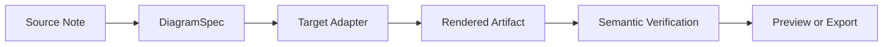
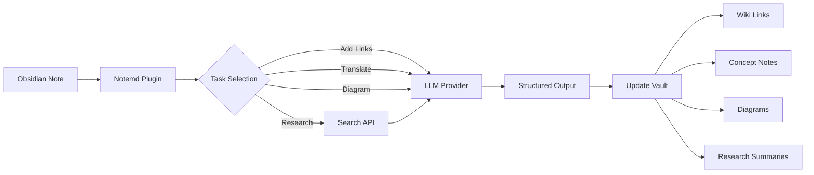

import TLDR from '@site/src/components/TLDR';

# Notemd简介

<TLDR>
**Notemd**（Note + EMD — 增强型 Markdown 文档）是一款开源的 Obsidian 插件，可将基于 LLM 的阅读内容转化为持久化的知识。与会话结束后见解即消失的聊天式 AI 不同，Notemd 会将结果以维基链接、概念笔记、研究摘要、翻译内容、工作流程及图表等形式**直接保存到您的知识库中**。它专为那些希望将阅读、研究及可视化解释整合为结构化、不断发展的知识图谱的研究人员、学生和知识工作者设计。
</TLDR>

## 什么是 Notemd？

Notemd 将 **30 多种大型语言模型**（OpenAI、Anthropic、Google、DeepSeek、Qwen、Ollama 等）集成到您的 Obsidian 工作流中，从而实现知识提取、整理、翻译、研究以及图表生成的自动化处理。

### 关键区别：临时知识与持久知识

| 方面 | 基于聊天的人工智能（ChatGPT等） | Notemd |
|--------|-------------------------------|--------|
| **结果存储位置** | 聊天记录（会消失） | 您的 Obsidian 保险库（已持久化） |
| **格式** | 纯文本答案 | 结构化文件：`[[wiki-links]]`、概念说明、图表 |
| **长期价值** | 每次都必须重新询问。 | 累积成知识图谱 |
| **离线访问** | 需要网络连接 | 可完全离线使用 Ollama |

## 核心功能

### 1. **自动维基链接生成**
- LLM 用于标记笔记中的关键概念
- 在每个出现的位置插入 `[[wiki-links]]`
- 可选地创建关联的概念笔记
- 通过同义词抑制来避免重复内容

### 2. **概念说明文档生成**
- 从论文、文章和笔记中提取核心概念
- 生成带有反向链接的专用概念文件
- 可自定义的输出路径和模板

### 3. **网络调研集成**
- 在 Obsidian 中查询 Tavily 或 DuckDuckGo
- LLM 会附上引用来源汇总结果
- 将研究结果追加到当前笔记中

### 4. **多语言翻译**
- 翻译选中内容或整个笔记
- 支持21种以上的UI语言
- 独立的输出语言配置
- 批量翻译支持

### 5. **图表生成**
- **Mermaid**：流程图、时序图、类图、状态图、ER图、甘特图
- **JSON Canvas**：Obsidian 原生布局
- **Vega-Lite**：数据图表、时间序列图、散点图
- **HTML / 可编辑的 HTML/SVG**：带有语义标注的独立图表资源
- **Draw.io / Drawnix 构件边界**：来自同一语义模型、面向维护者的导出路径
- **电路图路线图**：circuitikz/TikZJax 的功能设计以黄金参考标准、受限提示、渲染反馈以及拓扑结构/布局验证为核心，而非直接使用无限制的 LLM TikZ。
- **预览诊断**：渲染瑕疵可能会显示出编译/渲染过程中的错误信息，而且无需插件端的 LaTeX 运行时即可查看非内联代码源。
- 针对 Mermaid 错误的语法自动修复

### 6. **一键工作流**
- 将多个操作串联为侧边栏按钮
- 基于 DSL 的工作流定义
- 示例：`add-links > extract-concepts > research > diagram`

## 谁应该使用 Notemd？

✅ 正在阅读论文并撰写文献综述的**研究人员**
✅ **学生**整理学习笔记并创建概念图
✅ 希望让阅读心得持久保存的**知识型工作者**
✅ 需要翻译服务及维基链接搭建的**双语专业人员**
✅ 希望获得本地 LLM 支持且注重隐私的用户 (Ollama)
✅ **高级用户**：可自定义提示词和工作流程

## 为什么是 Notemd 加上 Obsidian？

**Obsidian** 是一个以本地优先、基于 Markdown 的知识库。**Notemd** 则为其增添了人工智能功能：
- 您的数据将保存在您的私密存储空间中（而非云服务）。
- 可使用本地模型离线运行
- 免费且开源（MIT许可证）
- 与现有的 Obsidian 插件集成
- 可扩展至数万条音符

## 入门指南

1. **安装**：设置 → 社区插件 → 浏览 → "Notemd"
2. **配置**：添加您的 LLM 提供商 API 密钥（或使用本地 Ollama）
3. **试试看**：打开一个笔记 → 右键点击 → “处理文件（添加链接）”
4. **探索**：在侧边栏查看一键式工作流

👉 [安装指南](./getting-started/installation) | [快速入门教程](./getting-started/quick-start)

## 图表功能方向

Notemd的图表生成方式正在从“让模型直接输出一个语法字符串”转向分层处理流程：

当前的实现已经支持 Mermaid、JSON Canvas、Vega-Lite、HTML 的回退机制，可编辑的 HTML/SVG，Draw.io XML 类型的工件，最基础的 Drawnix JSON 子集，预览诊断/仅源代码模式下的回退功能，以及针对常见源代码和 CMOS 反相器黄金模板的离线 `CircuitSpec -> circuitikz` 原型功能。电路图则更为复杂：虽然 circuitikz 能够准确表达电气拓扑结构，但未经约束的 LLM 输出往往会产生难以辨认的布线结果或无法渲染的 LaTeX 代码。未来的发展方向是通过对黄金参考模板、节点网格布局规则、渲染诊断功能以及截图反馈循环进行约束，来继续规范 circuitikz 的使用。

请查看[Diagrams](./features/diagrams)中的详细内容。

## 架构

## Notemd 与其他 Obsidian AI 插件对比

大多数 Obsidian AI 插件都是以对话为主（你提问，AI 回答，洞察内容留在聊天记录中）。而 Notemd 则是**以写作为主**：AI 会处理你的笔记，并将结构化的结果直接写入你的存储库中。

| 功能特性 | Notemd | Copilot | Smart Connections | Text Generator |
|-----------|--------|---------|-------------------|-----------------|
| 自动插入维基链接 | 是的 | 不行 | 不行 | 不行 |
| 概念说明文档生成 | 是（包含反向链接和去重） | 不行 | 不行 | 不行 |
| 图表生成 | 是的（Mermaid、Canvas、Vega-Lite、HTML、可编辑的工件） | 不行 | 不行 | 不行 |
| 网页搜索集成 | 是的（Tavily + DuckDuckGo） | 不行 | 不行 | 不行 |
| 批量文件夹处理 | 是的 | 数量有限 | 不行 | 数量有限 |
| 按任务模型路由 | 是（7个任务，独立模型） | 不行 | 不行 | 不行 |
| 一键工作流链 | 是（DSL） | 不行 | 不行 | 不行 |
| 翻译（批量） | 是的 | 不行 | 不行 | 不行 |
| 与 Vault 聊天 | 不行 | 是的 | 不行 | 不行 |
| 语义相似度搜索 | 不行 | 不行 | 是的 | 不行 |
| 基于模板的生成 | 不行 | 不行 | 不行 | 是的 |
| LLM 提供商 | 36（云端 + 网关 + 本地） | 3-5 | 2-3 | 3-5 |
| 完全离线 | 是的（Ollama） | 部分 | 部分 | 部分 |

**何时选择 Notemd**：当您希望人工智能构建一个持久的知识图谱——而不仅仅是针对您的笔记进行对话时。

**何时选择 Copilot**：如果您希望在 Obsidian 中拥有一个对话式人工智能助手。

**何时选择 Smart Connections**：当您希望通过语义搜索来发现笔记之间的现有关联时。

## 哲学

**Notemd**认为人工智能应当辅助人类的知识工作，而非取代它。该插件：
- 让您始终掌控全局（在应用更改前进行审核）
- 保留上下文（所有结果均指向来源）
- 保护隐私（支持本地 LLM，无远程数据收集）
- 具有可扩展性（开放 API 接口，支持自定义工作流）

## 开源

- **许可证**：MIT
- **来源**：[github.com/Jacobinwwey/obsidian-NotEMD](https://github.com/Jacobinwwey/obsidian-NotEMD)
- **社区**：[Discord](https://discord.gg/qnGgsQ9W) | [GitHub Discussions](https://github.com/Jacobinwwey/obsidian-NotEMD/discussions)
- **贡献**：欢迎提交 Pull Request，详情请参阅 [CONTRIBUTING.md](https://github.com/Jacobinwwey/obsidian-NotEMD/blob/main/CONTRIBUTING.md)

---

**下一步**：[安装 →](./getting-started/installation)
