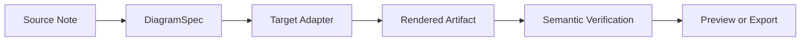
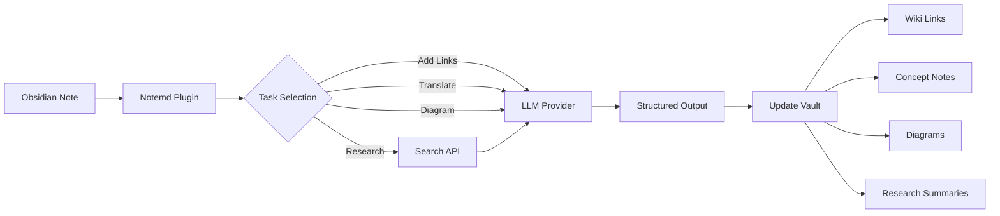

import TLDR from '@site/src/components/TLDR';

# Notemd 介绍

<TLDR>
**Notemd**（Note + EMD — Enhanced Markdown Documents）是一个开源 Obsidian 插件，用来把 LLM 辅助阅读转化为持久知识。和结论留在聊天历史里的对话式 AI 不同，Notemd 会把结果**直接写入你的库**：wiki-links、概念笔记、研究摘要、翻译、工作流与图表都会成为 Markdown 知识库的一部分。它面向研究人员、学生与知识工作者，让阅读、研究和可视化解释不断积累成结构化、可演化的知识图谱。
</TLDR>

## Notemd 是什么？

Notemd 将 **30+ 大语言模型**（OpenAI、Anthropic、Google、DeepSeek、Qwen、Ollama 等）接入 Obsidian 工作流，用来自动完成知识抽取、组织、翻译、研究与图表生成。

### 关键差异：短暂知识 vs. 持久知识

| 维度 | 对话式 AI（ChatGPT 等） | Notemd |
|------|--------------------------|--------|
| **结果去哪里** | 聊天历史（会消散） | 你的 Obsidian 库（会持久保存） |
| **格式** | 普通文本回答 | 结构化文件：`[[wiki-links]]`、概念笔记、图表 |
| **长期价值** | 每次都要重新提问 | 持续积累为知识图谱 |
| **离线访问** | 通常需要联网 | 配合 Ollama 可完全离线运行 |

## 核心能力

### 1. **自动 Wiki 链接**
- LLM 识别笔记中的关键概念
- 在每个出现位置插入 `[[wiki-links]]`
- 可选地创建链接到的概念笔记
- 通过同义词抑制避免重复

### 2. **概念笔记生成**
- 从论文、文章、笔记中抽取核心概念
- 生成带反向链接的独立概念文件
- 支持自定义输出路径和模板

### 3. **Web 研究集成**
- 在 Obsidian 内调用 Tavily 或 DuckDuckGo
- LLM 基于来源引用总结结果
- 将研究发现追加到当前笔记

### 4. **多语言翻译**
- 翻译选中文本或整篇笔记
- 支持 21+ 种 UI 语言
- 输出语言可独立配置
- 支持批量翻译

### 5. **图表生成**
- **Mermaid**：流程图、时序图、类图、状态图、ER 图、甘特图
- **JSON Canvas**：Obsidian 原生布局
- **Vega-Lite**：数据图、时间序列、散点图
- **HTML / Editable HTML/SVG**：带语义注解的自包含 figure artifact
- **Draw.io / Drawnix artifact 边界**：从同一个语义 figure model 导出的维护者级产物路径
- **电路图路线图**：circuitikz/TikZJax 支持会围绕 golden reference、强约束 prompt、渲染反馈和拓扑/布局校验设计，而不是依赖不受约束的 LLM TikZ 输出
- **预览诊断**：render artifact 可以展示 compile/render smoke diagnostics，非 inline source 也可以在不要求插件侧 LaTeX runtime 的情况下检查
- Mermaid 语法错误自动修复

### 6. **一键工作流**
- 将多个动作串联成侧边栏按钮
- 使用 DSL 定义工作流
- 示例：`add-links > extract-concepts > research > diagram`

## 谁适合使用 Notemd？

- ✅ **研究人员**：阅读论文、构建文献综述
- ✅ **学生**：整理学习笔记、创建概念图
- ✅ **知识工作者**：希望阅读洞察长期保留
- ✅ **双语专业人士**：需要翻译 + wiki-linking
- ✅ **隐私优先用户**：需要本地 LLM 支持（Ollama）
- ✅ **高级用户**：希望自定义 prompt 和工作流

## 为什么是 Notemd + Obsidian？

**Obsidian** 是本地优先、基于 Markdown 的知识库。**Notemd** 增加 AI 能力：
- 数据保留在你的 vault 中，而不是云端服务
- 配合本地模型可离线运行
- 免费且开源（MIT 许可）
- 可融入现有 Obsidian 插件生态
- 能扩展到数万篇笔记

## Getting Started

1. **安装**：Settings → Community Plugins → Browse → "Notemd"
2. **配置**：添加 LLM provider API key，或使用本地 Ollama
3. **试用**：打开一篇笔记 → 右键 → "Process file (add links)"
4. **探索**：查看侧边栏中的一键工作流

👉 [安装指南](./getting-started/installation) | [快速开始教程](./getting-started/quick-start)

## 图表能力方向

Notemd 的图表工作正在从“让模型直接写某一种语法字符串”转向分层管线：

当前实现已经支持 Mermaid、JSON Canvas、Vega-Lite、HTML fallback、editable HTML/SVG、Draw.io XML artifact、最小 Drawnix JSON subset、preview diagnostics / source-only fallback，以及面向 common-source 和 CMOS inverter golden templates 的离线 `CircuitSpec -> circuitikz` 原型。电路图是更难的一类：circuitikz 可以准确表达电路拓扑，但不受约束的 LLM 输出经常产生不可读的布线或无法渲染的 LaTeX。下一步方向是继续把 circuitikz 作为强约束 target：使用 golden-reference 模板、节点网格布局规则、渲染诊断和截图反馈闭环。

详细内容见 [图表与可编辑 Figure](./features/diagrams)。

## 架构

## Notemd vs Other Obsidian AI Plugins

大多数 Obsidian AI 插件是 conversation-first：你提问，AI 回答，洞察留在聊天里。Notemd 是 **write-first**：AI 处理你的笔记，并把结构化结果直接写入 vault。

| 能力 | Notemd | Copilot | Smart Connections | Text Generator |
|------|--------|---------|-------------------|----------------|
| 自动插入 wiki-links | Yes | No | No | No |
| 概念笔记生成 | Yes（含反向链接 + 去重） | No | No | No |
| 图表生成 | Yes（Mermaid、Canvas、Vega-Lite、HTML、editable artifacts） | No | No | No |
| Web 研究集成 | Yes（Tavily + DuckDuckGo） | No | No | No |
| 批量文件夹处理 | Yes | Limited | No | Limited |
| 按任务选择模型 | Yes（7 个任务，独立模型） | No | No | No |
| 一键工作流链 | Yes（DSL） | No | No | No |
| 翻译（批量） | Yes | No | No | No |
| 与 vault 聊天 | No | Yes | No | No |
| 语义相似搜索 | No | No | Yes | No |
| 基于模板生成 | No | No | No | Yes |
| LLM providers | 36（云端 + 网关 + 本地） | 3-5 | 2-3 | 3-5 |
| 完全离线 | Yes（Ollama） | Partial | Partial | Partial |

**什么时候选择 Notemd**：你希望 AI 构建持久知识图谱，而不只是围绕笔记聊天。

**什么时候选择 Copilot**：你需要 Obsidian 内的对话式 AI 助手。

**什么时候选择 Smart Connections**：你想通过语义搜索发现已有笔记之间的关系。

## Philosophy

**Notemd 相信 AI 应该增强人类知识工作，而不是替代它。** 插件会：
- 保持你对变更的控制（应用前可审阅）
- 保留上下文（所有结果都能链接回来源）
- 尊重隐私（支持本地 LLM，无遥测）
- 保持可扩展（开放 API、自定义工作流）

## Open Source

- **License**：MIT
- **Source**：[github.com/Jacobinwwey/obsidian-NotEMD](https://github.com/Jacobinwwey/obsidian-NotEMD)
- **Community**：[Discord](https://discord.gg/qnGgsQ9W) | [GitHub Discussions](https://github.com/Jacobinwwey/obsidian-NotEMD/discussions)
- **Contribute**：欢迎 PR，见 [CONTRIBUTING.md](https://github.com/Jacobinwwey/obsidian-NotEMD/blob/main/CONTRIBUTING.md)

---

**下一步**：[安装 →](./getting-started/installation)
