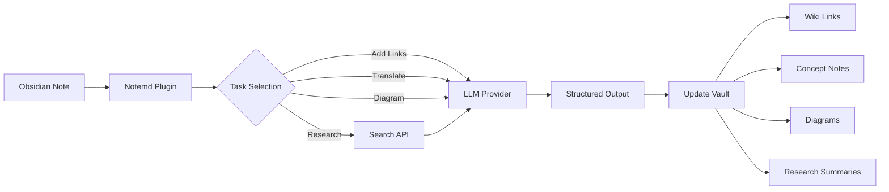

import TLDR from '@site/src/components/TLDR';

# Notemd 简介

<TLDR>
**Notemd**（Note + EMD，Enhanced Markdown Documents）是一个开源 Obsidian 插件，用来把 LLM 阅读结果沉淀成长期可用的知识。它不是把结论留在聊天记录里，而是把 wiki 链接、概念笔记、研究摘要、翻译和图表直接写回你的 vault。它适合研究者、学生和知识工作者，把一次次阅读积累成可演进的知识图谱。
</TLDR>

## Notemd 是什么？

Notemd 把 **30+ 大语言模型**（OpenAI、Anthropic、Google、DeepSeek、Qwen、Ollama 等）接入 Obsidian 工作流，用于自动抽取、连接和组织知识。

### 关键差异：临时回答 vs. 持久知识

| 维度 | 聊天式 AI（ChatGPT 等） | Notemd |
|---|---|---|
| **结果保存在哪里** | 聊天记录，后续容易丢失上下文 | Obsidian vault，随笔记长期存在 |
| **输出格式** | 普通文本回答 | 结构化文件：`[[wiki-links]]`、概念笔记、图表 |
| **长期价值** | 下次常要重新提问 | 持续积累成知识图谱 |
| **离线能力** | 通常依赖网络 | 配合 Ollama 可完全离线 |

## 核心能力

### 1. 自动 Wiki-Link

- LLM 识别笔记中的关键概念
- 在概念出现处插入 `[[wiki-links]]`
- 可选创建对应概念笔记
- 支持同义词抑制，避免重复节点

### 2. 概念笔记生成

- 从论文、文章和普通笔记中抽取核心概念
- 生成带反向链接的独立概念文件
- 支持自定义输出路径和模板

### 3. Web Research 集成

- 在 Obsidian 内调用 Tavily 或 DuckDuckGo
- 由 LLM 汇总搜索结果并保留来源
- 将研究结论追加到当前笔记

### 4. 多语言翻译

- 翻译选中文本或整篇笔记
- 支持 21+ UI 语言
- UI 语言、输出语言、翻译目标语言可独立配置
- 支持批量翻译

### 5. 图表生成

- **Mermaid**：流程图、时序图、类图、状态图、ER、Gantt
- **JSON Canvas**：Obsidian 原生画布布局
- **Vega-Lite**：数据图、时间序列、散点图
- Mermaid 语法错误可自动修复

### 6. 一键工作流

- 将多个动作串成侧边栏按钮
- 使用 DSL 定义流程
- 示例：`add-links > extract-concepts > research > diagram`

## 谁适合用 Notemd？

- 阅读论文、构建文献综述的研究者
- 整理课程笔记、制作概念地图的学生
- 希望阅读结论长期留在 vault 里的知识工作者
- 需要翻译与 wiki-link 联动的双语用户
- 想用 Ollama 等本地模型的隐私敏感用户
- 需要自定义 prompt 和工作流的高级用户

## 为什么是 Notemd + Obsidian？

**Obsidian** 是本地优先、基于 Markdown 的知识库。**Notemd** 在这个基础上增加 AI 工作流：

- 数据留在你的 vault，而不是云端服务
- 本地模型可离线运行
- 免费、开源，MIT 许可证
- 能和现有 Obsidian 插件共存
- 可扩展到数万篇笔记

## 快速开始

1. **安装**：Settings → Community Plugins → Browse → “Notemd”
2. **配置**：添加 LLM Provider API key，或使用本地 Ollama
3. **试运行**：打开一篇笔记 → 右键 → “Process file (add links)”
4. **继续探索**：查看侧边栏的一键工作流

[安装指南](./getting-started/installation) | [快速开始](./getting-started/quick-start)

## 架构

## Notemd 与其他 Obsidian AI 插件

很多 Obsidian AI 插件是 conversation-first：你提问，AI 回答，结论留在聊天里。Notemd 是 **write-first**：AI 处理你的笔记，并把结构化结果直接写回 vault。

| 能力 | Notemd | Copilot | Smart Connections | Text Generator |
|---|---|---|---|---|
| 自动插入 wiki-link | Yes | No | No | No |
| 概念笔记生成 | Yes（带反链与去重） | No | No | No |
| 图表生成 | Yes（Mermaid、Canvas、Vega-Lite、HTML） | No | No | No |
| Web research | Yes（Tavily + DuckDuckGo） | No | No | No |
| 文件夹批处理 | Yes | Limited | No | Limited |
| 按任务选择模型 | Yes（7 类任务独立模型） | No | No | No |
| 一键工作流链 | Yes（DSL） | No | No | No |
| 批量翻译 | Yes | No | No | No |
| 与 vault 聊天 | No | Yes | No | No |
| 语义相似搜索 | No | No | Yes | No |
| 模板式生成 | No | No | No | Yes |
| LLM providers | 36（云端、网关、本地） | 3-5 | 2-3 | 3-5 |
| 完全离线 | Yes（Ollama） | Partial | Partial | Partial |

**选择 Notemd**：你希望 AI 帮你构建持久知识图谱，而不是只和笔记聊天。

**选择 Copilot**：你主要需要 Obsidian 内的对话式 AI 助手。

**选择 Smart Connections**：你主要想通过语义搜索发现已有笔记之间的关系。

## 设计取向

Notemd 的前提是：AI 应该增强人的知识工作，而不是替代它。

- 让用户保持控制，应用修改前可以审查
- 保留上下文，结果能回到源笔记
- 尊重隐私，支持本地 LLM，不做遥测
- 保持可扩展，支持自定义 prompt 和工作流

## 开源

- **License**：MIT
- **Source**：[github.com/Jacobinwwey/obsidian-NotEMD](https://github.com/Jacobinwwey/obsidian-NotEMD)
- **Community**：[Discord](https://discord.gg/qnGgsQ9W) | [GitHub Discussions](https://github.com/Jacobinwwey/obsidian-NotEMD/discussions)
- **Contribute**：欢迎 PR，参见 [CONTRIBUTING.md](https://github.com/Jacobinwwey/obsidian-NotEMD/blob/main/CONTRIBUTING.md)

---

**下一步**：[安装 →](./getting-started/installation)
