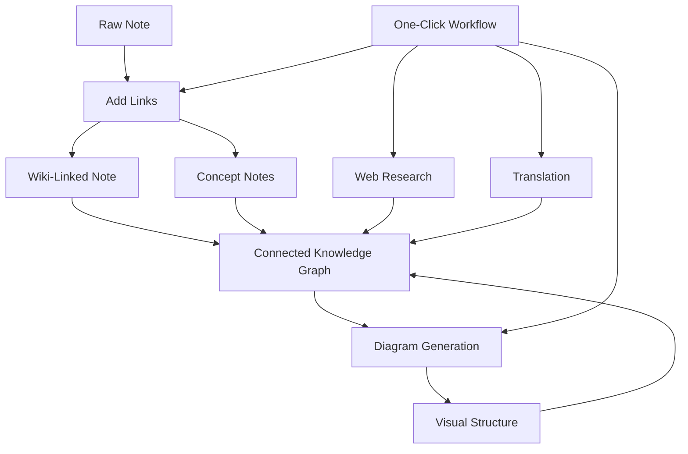

import TLDR from '@site/src/components/TLDR';

# Obsidian AI知识管理指南

<TLDR>
**Notemd** 能将基于 LLM 的阅读内容转化为持久的知识体系：wiki 链接可串联各种概念，概念笔记能构建可检索的知识图谱，研究功能可将网络资源导入您的知识库，翻译功能可打破语言障碍，图表功能能让结构一目了然，而工作流则只需点击一下即可将所有元素整合在一起。本指南涵盖了从原始笔记到结构化、可视化且支持多语言的知识库的完整流程。
</TLDR>

## 为何选择人工智能知识管理？

传统的笔记方式会生成扁平文件。即便使用了手动创建的维基链接，大多数笔记依然彼此孤立。Notemd 利用 LLMs 自动处理这些连接关系。

- **LLMs 会读取您的内容**，并识别出关键信息——术语、方法、人物、理论
- 在每个概念出现的地方都会**自动插入链接**，而不会被放在“另请参阅”中。
- **概念说明**会作为独立的可检索文件生成。
- **研究功能**通过网页来源的上下文来丰富笔记内容
- **图表能让结构一目了然**——基于相同内容的思维导图、流程图和数据图表

最终结果是一个知识图谱，它会随着你处理的每条笔记而不断扩展，而不仅仅在你记得添加链接时才会变化。

## 完整的处理流程



每个步骤都是独立的。可以使用其中一个或全部。最具影响力的顺序为：**添加链接 → 概念说明 → 图表**。

---

## 1. 维基链接：明确建立关联

维基链接是知识图谱的支柱。Notemd 使用 LLM 来：

1. 读取您的笔记内容（长文档会拆分成多个部分）
2. 识别核心概念——优先考虑具体的技术术语，而非通用名词
3. 在每个出现的位置插入 `[[wiki-links]]`
4. 抑制同义词，避免“ML”和“机器学习”生成独立的节点

### 何时使用

- **每条笔记字数需大于100字**——较短的笔记难以涵盖完整概念
- **研究论文、技术文档、会议记录**——充满了领域特定的术语
- **在内容稳定后** —— 请勿重复处理草稿

### 关键设置

| 设置 | 推荐 | 为什么 |
|---------|-----------|-----|
| `addLinksProvider` | DeepSeek 或 GPT-4o-mini | 低成本却具备出色的准确度 |
| 同义词抑制 | 开启 | 防止节点重复 |
| 上下文窗口 | 段落 | 在精度与成本之间取得平衡 |

→ [Wiki-Links 深入解析](/docs/features/wiki-links)

---

## 2. 概念说明：可检索的知识节点

维基链接可将各种概念在文本中相互关联，而概念笔记则能让每个概念独立被检索到。每个概念都有其专属的 `.md` 文件：

```markdown
# Machine Learning

## Linked From
- [[My Research Notes]]
- [[Neural Networks Explained]]
```

### 提取过程

LLM 提示语的结构非常严谨：
- 转换为单数形式
- 优先使用多词概念而非单字（如“介电松弛”而非“松弛”）
- 跳过参考文献/参考页部分
- 以 `CONCEPT:` 行的形式输出，以便进行确定性解析

各个数据块中的概念会通过 `Set<string>` 进行去重处理。单个数据块出现的 LLM 错误不会导致整个操作中止。

### 反向链接

启用后，每条概念笔记都会记录有哪些来源笔记提到了它。Obsidian 的内置反向链接面板也会显示这些反向连接。

### 去重

Notemd的4步去重引擎能够检测到：
1. **完全匹配** — 不区分大小写的文件名比较
2. **复数形式** — “Models.md”与“Model.md”的区别
3. **符号规范化** — “A-B.md”与“A B.md”的区别
4. **单词包含检测**——当存在“Machine Learning.md”时，会标记“ML.md”

### 关键设置

| 设置 | 推荐 | 为什么 |
|---------|-----------|-----|
| `conceptNoteFolder` | `concepts/` 或 `🧠 concepts/` | 保持保险库井然有序 |
| `extractConceptsAddBacklink` | 开启 | 启用反向查找 |
| `extractConceptsMinimalTemplate` | 关闭 | 包含“链接自”字段的完整模板 |
| 任务级模型 | DeepSeek | 概念提取不需要昂贵的模型。 |
| 同义词抑制 | 开启 | 相同的设置同时影响链接和提取功能。 |

→ [概念说明深入解析](/docs/features/concept-notes)

---

## 3. 研究：将网络引入其中

Notemd 将网络搜索功能整合到您的笔记工作中：

1. **查询构建** — 您的笔记标题或选择内容将作为搜索查询
2. **网络搜索** — Tavily（推荐，需要 API 密钥）或 DuckDuckGo（免费，无需密钥）
3. **LLM 摘要功能** — 将搜索结果浓缩为相关的摘要
4. **追加到笔记**——在光标位置或作为新章节添加摘要

### 何时使用

- 在处理新主题之前——先获取网页上下文
- 当概念说明需要补充内容时——先进行研究，然后再添加链接
- 用于文献综述——批量处理一个笔记文件夹

### 关键设置

| 设置 | 推荐 | 为什么 |
|---------|-----------|-----|
| `researchProvider` | GPT-4o还是Claude | 研究需要更高质量的摘要生成。 |
| 搜索服务 | Tavily | 更高的相关性，可配置的深度 |
| `maxResearchContentTokens` | 4000 | 深度与成本之间的平衡 |

→ [深入研究](/docs/features/research)

---

## 4. 翻译：打破语言障碍

Notemd 会使用您配置的 LLM 来翻译笔记——而非专门的翻译 API。这意味着：

- **上下文感知翻译**——LLM能够理解整份文档，而不仅仅是逐句翻译
- **技术术语处理** — “梯度下降”应保持为“梯度下降”，而非“坡度向下”
- **批量支持**——可一次性翻译整个笔记文件夹中的所有内容
- **按任务模型**——使用 Gemini Flash 进行翻译（快速、廉价且支持多语言）

### 语言支持

Notemd 本身支持 21 种 UI 语言。翻译目标语言可针对每个任务进行配置。常见的语言对包括：EN↔ZH、EN↔JA、EN↔KO、EN↔DE、EN↔FR、EN↔ES。

→ [翻译详解](/docs/features/translation)

---

## 5. 图表：让结构可视化

Notemd的图表处理流程以规范优先：首先由LLM生成结构化的`DiagramSpec` JSON，随后通过适配器将其转换为目标格式。这种方式比让LLM直接处理原始的Mermaid语法能产生更可靠的输出。

### 意图检测

Notemd 会根据内容推断出最佳的图表类型：

- **带数字的表格** → 数据图表 (Vega-Lite)
- **客户端/服务器术语** → 序列图 (Mermaid)
- **实体/主键** → ER图 (Mermaid)
- **步骤/流程图** → 流程图 (Mermaid)
- **概念图关键词** → JSON Canvas (Obsidian 原生)
- **默认** → 思维导图 (Mermaid)

### 渲染链

主要目标 → 备用方案 → 备用方案 → HTML。如果 Mermaid 语法出错，它会向 LLM 发送错误信息后重试一次，否则就会退而使用最简的图表。

### 关键设置

| 设置 | 推荐 | 为什么 |
|---------|-----------|-----|
| `enableExperimentalDiagramPipeline` | 开启 | 以规格优先，提升质量 |
| `experimentalDiagramCompatibilityMode` | `best-fit` | 每个意图的默认目标 |
| `summarizeToMermaidProvider` | GPT-4o还是Claude | 图表规范需要空间推理能力。 |
| `autoMermaidFixAfterGenerate` | 开启 | 自动捕获 LLM 语法错误 |
| 本地知识增强 | 针对特定域启用 | 通过保险库上下文提升准确性 |

→ [图表深度解析](/docs/features/diagrams)

---

## 6. 工作流：一键自动化

工作流可将多个任务串联为一个侧边栏按钮。其 DSL 格式为：

```
task1 | task2 | task3
```

示例：`addLinks` | 提取概念 | generateDiagram` — 一键将笔记从原始文本转换为完全连接的可视化知识节点。

### 推荐的工作流程

| 工作流 | 链条 | 用例 |
|----------|-------|----------|
| 完整流程 | `addLinks \| extractConcepts \| generateDiagram` | 新笔记 |
| 先进行研究 | `research \| addLinks` | 不熟悉的主题 |
| 多语言支持 | `translate \| addLinks` | 多语言笔记 |
| 仅显示图表 | `generateDiagram` | 快速可视化 |

→ [工作流深度解析](/docs/features/workflows)

---

## 7. LLM 提供商：从云端到本地的36种选择

Notemd 支持 4 种传输类型下的 36 家提供商。关键组：

- **国际云服务**：OpenAI、Anthropic、Google、Mistral、xAI
- **中国云**：DeepSeek、Qwen、Doubao、Moonshot、GLM、百度、SiliconFlow
- **网关**：OpenRouter、GitHub Models、Hugging Face、Vercel
- **本地**：Ollama、LMStudio、OVMS — 无 API 键，数据不会离开您的机器

### 按任务模型策略

最经济高效的配置方式是：用低成本模型处理简单任务，用高性能模型处理复杂任务。

```
extractConcepts  → DeepSeek (fast, cheap, accurate enough)
addLinks          → DeepSeek or GPT-4o-mini
research          → GPT-4o or Claude (needs quality)
generateDiagram   → GPT-4o or Claude (needs spatial reasoning)
translate         → Gemini Flash (fast, multilingual)
```

→ [LLM 提供商概览](/docs/providers/overview)

---

## 入门检查清单

1. **安装 Notemd** — [社区插件](/docs/getting-started/installation)（推荐）或手动安装
2. **配置提供商** — DeepSeek（最简单），OpenAI，或 Ollama（免费）
3. **处理您的第一条笔记** — 右键点击 → “处理文件（添加链接）”
4. **设置概念文件夹** — 设置 → Notemd → 输出 → 概念文件夹
5. **提取概念** — 对同一张便签运行“提取概念”操作
6. **生成图表** — 运行“Generate diagram”以可视化这些连接关系
7. **创建工作流**——将上述步骤串联成一个一键按钮

## 推荐配置

### 学生（预算）

```
Provider: DeepSeek (free tier available)
Concept extraction: DeepSeek
Research: DuckDuckGo (free) + DeepSeek
Diagrams: Off (or legacy Mermaid)
Workflows: addLinks | extractConcepts
```

### 研究员（质量）

```
Provider: GPT-4o (primary)
Concept extraction: DeepSeek (cost savings)
Research: GPT-4o + Tavily
Diagrams: best-fit mode, GPT-4o
Workflows: research | addLinks | extractConcepts | generateDiagram
```

### 隐私优先（仅本地）

```
Provider: Ollama (llama3 or qwen2.5:7b)
All tasks: Ollama
Research: DuckDuckGo (free, no API key)
Diagrams: legacy Mermaid mode
```

### 双语（中文 + 英文）

```
Primary: DeepSeek (Chinese queries)
Translation: Google Gemini Flash
Research: Tavily + DeepSeek (Chinese search context)
Language output: per-task (extractConceptsLanguage: zh-CN)
```

---

## 常见模式

### 模式：处理一篇研究论文

1. 导入 PDF 内容（或直接粘贴）
2. **研究** — 获取该主题的网页相关内容
3. **添加链接** — 识别并关联关键概念
4. **提取概念** — 创建独立笔记
5. **生成图表** — 可视化论文的结构

### 模式：每日笔记丰富功能

1. 撰写每日笔记
2. **添加链接** — 将今日的想法与现有概念关联起来
3. 概念说明会通过反向链接自动更新

### 模式：文献综述

1. 创建一个名为 papers/notes 的文件夹
2. **批量添加链接** — 处理整个文件夹
3. **去重概念** —— 清理近似重复的笔记
4. **生成图表** — 整个文献的思维导图

---

*Notemd 是开源项目（采用 MIT 许可证），可在所有平台上与 Obsidian 0.15.0+ 版本配合使用。[立即安装](/docs/getting-started/installation) 或 [在 GitHub 上查看](https://github.com/Jacobinwwey/obsidian-NotEMD)。*
