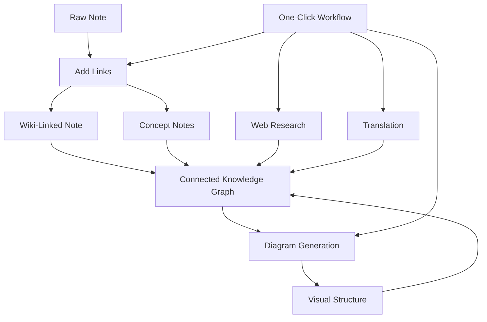

import TLDR from '@site/src/components/TLDR';

# Obsidian AI 知识管理指南

<TLDR>
**Notemd 把 LLM 阅读转成持久知识：wiki-links 连接概念，概念笔记形成可检索图谱，research 把 Web 信息写入 vault，翻译跨越语言边界，图表让结构可见，工作流把这些动作串成一键操作。** 本指南覆盖从原始笔记到连接型、可视化、多语言知识库的完整路径。
</TLDR>

## 为什么需要 AI Knowledge Management？

传统笔记往往只是扁平文件。即使手动加 wiki-links，大多数笔记仍然没有充分连接。Notemd 用 LLM 自动补上连接层：

- **LLM 阅读内容**，识别术语、方法、人物、理论等关键对象
- **自动插入链接**，概念在正文出现处就被连接，而不是只放在 “see also”
- **生成概念笔记**，让概念成为可检索的独立节点
- **Research 丰富上下文**，把 web-sourced 信息写回 vault
- **图表呈现结构**，从同一份内容生成 mind map、flowchart、data chart

结果是：知识图谱会随着每次处理增长，而不是只在你记得手动加链接时增长。

## 完整流程



每一步都可以独立使用。最常见、收益最高的顺序是：**Add Links → Concept Notes → Diagrams**。

---

## 1. Wiki-Links：把连接显式化

Wiki-links 是知识图谱的骨架。Notemd 会用 LLM：

1. 阅读笔记内容，长文会分 chunk
2. 识别核心概念，优先选择具体、技术性的术语
3. 在每次出现处插入 `[[wiki-links]]`
4. 进行同义词抑制，避免 “ML” 和 “Machine Learning” 变成两个节点

### 适用场景

- 超过 100 词的笔记
- 论文、技术文档、会议记录等概念密集内容
- 内容稳定后处理，不建议反复处理草稿

### 关键设置

| 设置 | 推荐 | 原因 |
|---|---|---|
| `addLinksProvider` | DeepSeek 或 GPT-4o-mini | 准确度和成本平衡好 |
| Synonym suppression | On | 避免重复节点 |
| Context window | Paragraph | 平衡准确度和成本 |

英文深入页：[Wiki-Link Generation](https://jacobinwwey.github.io/obsidian-NotEMD/docs/features/wiki-links)

---

## 2. Concept Notes：可检索的知识节点

Wiki-links 让正文中的概念相互连接，概念笔记则让每个概念成为独立文件：

```markdown
# Machine Learning

## Linked From
- [[My Research Notes]]
- [[Neural Networks Explained]]
```

### 抽取流程

LLM prompt 会严格约束输出：

- 规范化为单数形式
- 优先保留多词概念，如 “Dielectric Relaxation”
- 跳过 references / bibliography 区段
- 输出 `CONCEPT:` 行，方便确定性解析

概念会跨 chunk 去重。单个 chunk 的 LLM 错误不会中断整个操作。

### 去重

Notemd 的去重覆盖：

1. 精确匹配，大小写不敏感
2. 复数形式
3. 符号规范化
4. 单词包含，例如已有 “Machine Learning.md” 时提示 “ML.md” 风险

英文深入页：[Concept Notes](https://jacobinwwey.github.io/obsidian-NotEMD/docs/features/concept-notes)

---

## 3. Research：把 Web 信息写入笔记

Notemd 把 web search 接入笔记流程：

1. 用笔记标题或选中文本构造查询
2. 调用 Tavily 或 DuckDuckGo
3. 由 LLM 汇总搜索结果
4. 将摘要追加到光标位置或新小节

适用场景：

- 开始处理新主题前先补充 web context
- 丰富概念笔记
- 批量处理文献综述文件夹

| 设置 | 推荐 | 原因 |
|---|---|---|
| `researchProvider` | GPT-4o 或 Claude | Research 更依赖摘要质量 |
| Search service | Tavily | 相关性更好，可配置深度 |
| `maxResearchContentTokens` | 4000 | 平衡深度和成本 |

英文深入页：[Web Research](https://jacobinwwey.github.io/obsidian-NotEMD/docs/features/research)

---

## 4. Translation：跨越语言边界

Notemd 使用你配置的 LLM 翻译，而不是专用翻译 API。这带来几个结果：

- 能理解全文上下文，而不是逐句翻译
- 技术术语处理更稳
- 支持批量翻译整个文件夹
- 可为翻译任务单独指定模型，例如 Gemini Flash

常见语言对：EN↔ZH、EN↔JA、EN↔KO、EN↔DE、EN↔FR、EN↔ES。

英文深入页：[Translation](https://jacobinwwey.github.io/obsidian-NotEMD/docs/features/translation)

---

## 5. Diagrams：让结构可见

Notemd 的图表链路是 spec-first：LLM 先生成结构化 `DiagramSpec` JSON，再由 adapter 转成目标格式。相比直接要求 LLM 写 Mermaid，这条链路更可控。

### 意图识别

- 有数字表格 → Vega-Lite data chart
- client/server 语义 → Mermaid sequence diagram
- entity / primary key → Mermaid ER diagram
- 步骤/流程 → flowchart
- 概念图关键词 → JSON Canvas
- 默认 → Mermaid mind map

### 渲染链

主目标 → fallback → fallback → HTML。Mermaid 语法失败时，会带错误上下文重试一次，再回落到最小图。

英文深入页：[Diagram Generation](https://jacobinwwey.github.io/obsidian-NotEMD/docs/features/diagrams)

---

## 6. Workflows：一键自动化

工作流把多个任务串成侧边栏按钮。DSL 示例：

```text
task1 | task2 | task3
```

例如 `addLinks | extractConcepts | generateDiagram` 可以把一篇原始笔记处理成带链接、概念节点和图表的知识单元。

| Workflow | Chain | 场景 |
|---|---|---|
| Full Process | `addLinks \| extractConcepts \| generateDiagram` | 新笔记 |
| Research First | `research \| addLinks` | 陌生主题 |
| Polyglot | `translate \| addLinks` | 多语言笔记 |
| Diagram Only | `generateDiagram` | 快速可视化 |

英文深入页：[One-Click Workflows](https://jacobinwwey.github.io/obsidian-NotEMD/docs/features/workflows)

---

## 7. LLM Providers：从云端到本地的 36 种选择

Notemd 支持 36 个 providers，分为：

- **国际云端**：OpenAI、Anthropic、Google、Mistral、xAI
- **中国云端**：DeepSeek、Qwen、Doubao、Moonshot、GLM、Baidu、SiliconFlow
- **网关**：OpenRouter、GitHub Models、Hugging Face、Vercel
- **本地**：Ollama、LMStudio、OVMS，不需要 API key，数据不离开机器

### 按任务选择模型

最经济的方案是简单任务用便宜模型，复杂任务用强模型：

```text
extractConcepts  → DeepSeek
addLinks          → DeepSeek or GPT-4o-mini
research          → GPT-4o or Claude
generateDiagram   → GPT-4o or Claude
translate         → Gemini Flash
```

[LLM Providers overview](./providers/overview)

---

## 入门清单

1. **安装 Notemd**：[Community Plugins](./getting-started/installation) 或手动安装
2. **配置 provider**：DeepSeek、OpenAI 或 Ollama
3. **处理第一篇笔记**：右键 → “Process file (add links)”
4. **设置概念目录**：Settings → Notemd → Output → Concept Folder
5. **抽取概念**：对同一笔记运行 “Extract concepts”
6. **生成图表**：运行 “Generate diagram”
7. **创建工作流**：把以上步骤串成一键按钮

## 推荐配置

### 学生：低成本

```text
Provider: DeepSeek
Concept extraction: DeepSeek
Research: DuckDuckGo + DeepSeek
Diagrams: Off or legacy Mermaid
Workflows: addLinks | extractConcepts
```

### 研究者：质量优先

```text
Provider: GPT-4o
Concept extraction: DeepSeek
Research: GPT-4o + Tavily
Diagrams: best-fit mode, GPT-4o
Workflows: research | addLinks | extractConcepts | generateDiagram
```

### 隐私优先：全本地

```text
Provider: Ollama (llama3 or qwen2.5:7b)
All tasks: Ollama
Research: DuckDuckGo
Diagrams: legacy Mermaid mode
```

### 双语：ZH + EN

```text
Primary: DeepSeek
Translation: Google Gemini Flash
Research: Tavily + DeepSeek
Language output: per-task
```

---

*Notemd 开源、MIT 许可，支持 Obsidian 0.15.0+。可以从 [安装页](./getting-started/installation) 开始，或查看 [GitHub](https://github.com/Jacobinwwey/obsidian-NotEMD)。*
