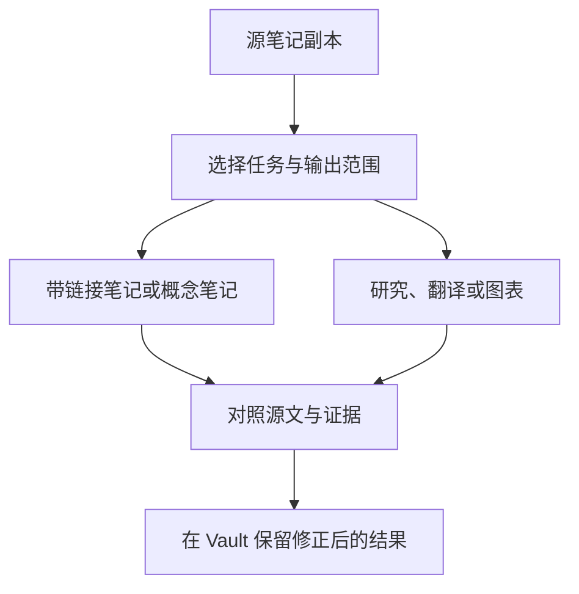

import TLDR from '@site/src/components/TLDR';

# Obsidian AI 知识管理指南

<TLDR>
有用的知识工作流应区分源材料、模型输出和你的更正。Notemd 的链接、提取、研究、翻译与图表任务会写入可检查文件。先验证单个来源，再自动化有边界的文件夹。
</TLDR>

## 明确目标

选择真正需要的产物：带链接阅读笔记、概念集、有来源摘要、译文或图表。文件和链接越多不代表理解或检索越好。先决定如何核对正确性，以及以后如何找到材料。

## 完整流程


```mermaid
flowchart TD
    A[源笔记副本] --> B[选择任务与输出范围]
    B --> C[带链接笔记或概念笔记]
    B --> D[研究、翻译或图表]
    C --> E[对照源文与证据]
    D --> E
    E --> F[在 Vault 保留修正后的结果]
```

这些是可选择的任务，不表示默认按钮会执行全部步骤。保留源文，组合流程前检查每个任务的输出位置。

## 1. Wiki 链接：显式建立关系

对测试笔记运行 **处理文件（添加链接）**，默认核对同级 `_processed.md`。检查候选术语是否有导航价值，引文、代码和公式是否忠实。

聚焦学习与同义词抑制可引导模型，不强制概念等价或数值相似度阈值。优先要求与现有文件名确定性匹配时，应使用确定性标题匹配。

[Wiki 链接指南](./features/wiki-links)

## 2. 概念笔记：区分术语与解释

提取前选择概念目录。独立提取默认创建仅标题笔记，不修改源文。新笔记需要 `Linked From` 时，开启反向链接并关闭最小模板。

提取与正文生成是不同操作。**从标题批量生成** 可处理所选目录内已有和新增的符合条件笔记。测试用专用目录，并检查 complete 目录移动行为。

重复审核基于文件名启发式，删除前确认候选；相近名称可能有不同技术含义。

[概念笔记指南](./features/concept-notes)

## 3. 研究：保留证据链

选择主题或使用活动标题，设置 Tavily 或 DuckDuckGo 后运行 **研究并总结**。缺少 Tavily key 不自动回退 DuckDuckGo。打开来源 URL，核对追加摘要的重要结论。

可选本地检索提供限定范围片段。当前索引为词法，片段发送给任务所选 LLM，因此本地索引不等于整个研究流程离线或仅在设备内处理。

[研究指南](./features/research)

## 4. 翻译：核对含义与结构

选择输出语言并运行文件翻译，默认使用 `_<language>.md`，已有目标可能覆盖。仅需段落时先复制到临时笔记。

对照原文检查术语、数字、代码、链接和数学符号。长文分块可能丢失跨块上下文。21 个 UI locale 和 34 个网站路由不证明任何语言对的翻译质量。

[翻译指南](./features/translation)

## 5. 图表：选择可编辑产物

选择图表类型与兼容源格式，核对预览，再保存源文件及需要的 SVG、PNG 或 PDF。渲染图片不证明其他编辑器保留所有语义关系。

采用选择器支持的目录项。CircuitikZ 有受限输出和独立原生编译环境检查；Drawnix 静态跨分支箭头不保证重排附着。PowerPoint 表格修复改善原生输出，Mermaid／SVG 仍可能图像回退。

[图表指南](./features/diagrams)

## 6. 工作流：自动化已验证步骤

工作流由名称、`::` 与 `>` 分隔的动作 ID 组成，默认如下：

```text
One-Click Extract::process-current-add-links>batch-generate-from-titles>batch-mermaid-fix
```

它执行链接、文件夹标题生成和 Mermaid 修复，不附加通用研究或图表生成。动作保留各自前置条件与输出行为，不是任意文本管道。

默认在步骤报告失败时停止。只有后续动作可使用剩余输入时才适合继续；取消保留已完成输出，不回滚。

[工作流指南](./features/workflows)

## 7. Provider：匹配协议与任务

36 个预设覆盖五类协议。根据端点、模型权限、数据政策和实测输出选择 provider。比较速度或费用时使用相同源文和提示词。

任务专用路由默认关闭，确需不同任务使用不同 profile 时再开启。判断本地化前逐项检查。

[Provider 概览](./providers/overview)

## 开始使用清单

1. 安装 Notemd，备份源文。
2. 配置并测试准确 provider/model。
3. 选择概念目录和独立输出位置。
4. 对笔记副本运行一个任务。
5. 对照原文并保留更正。
6. 扩大到小目录，检查部分完成后再构建较长工作流。

## 常见模式

### 处理研究论文

先用合适外部工具转为可读 Markdown，检查公式、图片和表格转换错误。提取概念或原文，研究选定问题；只有图表能说明可核验关系时才生成。保留原论文链接和更正。

### 维护概念集合

使用专用目录，提取后审核术语，只为明确选定子集生成解释。去重前备份；概念数量不能替代准确定义与有用导航。

### 处理私密材料

提前安装模型、服务与依赖，检查任务路由；要求离线时避免网络研究。分享前审核诊断。本地回环默认值不能阻止 profile 被配置为远端服务。

### 从中断批次恢复

等待取消或失败收敛，阅读报告，核对完成与恢复输出，比较冲突，仅重跑计划工作。不要由取消状态推断没有产物，也不要未经引用检查就删除配套文件。

## 后续阅读

- [快速开始](./getting-started/quick-start)：完成首个任务。
- [批量处理](./advanced/batch-processing)：选取与输出归属。
- [开发者指南](./developers/overview)：扩展与验证。
- [Agent 指南](./agents/overview)：发现实际公开契约。
