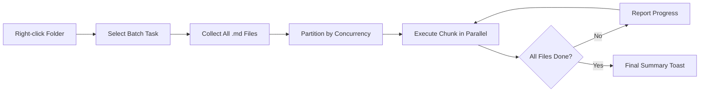

import TLDR from '@site/src/components/TLDR';

# 批次處理

<TLDR>
**Notemd 可透過可設定的同時處理數量與覆寫控制，一次處理整個資料夾。** 在資料夾上按右鍵即可批量新增維基連結、提取概念、進行研究，或翻譯其中的所有筆記。同時處理數量的限制可避免 API 的速率限制錯誤。進度會依檔案逐一報告。覆寫行為可自行設定：跳過現有內容、追加，或直接取代。失敗的檔案會被記錄下來，且不會中斷整個批次處理。

這是[Obsidian AI知識管理指南](/docs/pillar-ai-knowledge)的一部分。
</TLDR>

## 概覽

批次處理可將一個筆記資料夾轉換為單一操作。您不必逐一打開每個筆記並分別執行指令，只需右鍵點擊資料夾並選擇相關任務即可。Notemd會逐一處理每一個 `.md` 檔案，套用所選定的動作，並即時顯示處理進度。

此功能對於整個資料庫的知識抽取而言至關重要。例如，在匯入數十個 PDF 之後，透過先執行批次新增連結，再執行批次提取概念，就能在幾分鐘而非幾小時內建立您的知識圖譜。

## 它的運作原理是什麼

### 批次執行模型

1. **檔案收集** -- Notemd 會以遞迴方式掃描目標資料夾（或僅掃描最上層資料夾，視設定而定），並收集所有 `.md` 檔案。
2. **同時執行分割** -- 檔案會根據 `batchConcurrency` 的設定被分割成多個區塊。每個區塊以平行方式運作；而其他區塊則依序執行。
3. **執行** -- 每個檔案皆以與單一檔案指令相同的邏輯進行處理。會尊重每個任務的供應商及模型設定。
4. **進度報告** -- 每個檔案處理完成後，即會有提示通知更新，顯示 `N / Total` 的進度。
5. **錯誤處理** -- 若某個檔案處理失敗（如 API 錯誤、網路超時等），系統會將錯誤記錄下來，並讓批次繼續執行。最後的摘要會列出所有處理失敗的檔案。
6. **完成** -- 總結摘要會顯示已處理的總數、成功次數以及失敗次數。

### 覆寫行為

在處理已經包含維基連結、概念說明或翻譯的檔案時，Notemd 的行為會取決於覆寫設定：

| 模式 | 行為模式 |
|------|----------|
| **跳過** | 現有內容將保持不變。僅處理未經修改的檔案。 |
| **Append**（預設值） | 新的內容會被附加在後。現有的維基連結、概念或翻譯都將保持不變。 |
| **取代** | 檔案已完整重新處理。所有先前的 Notemd 修改都會被覆寫。 |

針對維基連結功能而言：如果筆記中已經包含 `[[wiki-links]]`，**skip** 模式會保持原狀，而 **replace** 模式則會將整個筆記重新傳送至 LLM 以插入新的連結。在進行增量處理時請使用 **skip**，在模型升級後重新處理時則請使用 **replace**。

### 併發控制

`batchConcurrency` 的設定會限制同時進行的 API 呼叫數量。這樣在做業時，即便面對有嚴格流量配額的服務供應商，也能避免出現速率限制錯誤（HTTP 429）。

| 同時執行 | 推薦給 | 典型的速率限制影響 |
|-------------|----------------|---------------------------|
| `1` | 免費方案、嚴格的供應商 | 無（序列號） |
| `3`（預設值） | 大多數雲端服務供應商 | 低 |
| `5` | Ollama（本地），豐厚的等級方案 | 無 / 低 |
| `10` | 具有快速推論功能的本地模型 | 無 |

如果在批次處理時遇到 429 錯誤，請將同時執行的數量降低至 1 或 2。

## 設定

| 設定 | 預設值 | 效果 |
|---------|---------|--------|
| `batchConcurrency` | `3` | 在資料夾操作期間，最大的平行 API 呼叫數量 |
| `batchOverwriteExisting` | `false` | 覆寫現有的 Notemd 內容。`false` = 追加模式。 |
| `batchSkipProcessed` | `false` | 跳過已包含 Notemd 標記的檔案（例如，維基連結）。 |
| `batchRecursive` | `true` | 掃描資料夾時包含子資料夾 |
| `enableStableApiCall` | `false` | 在批次處理時，為每個檔案啟用重試機制（最多 4 次嘗試） |

### 批次處理中的任務級模型

每個批次操作都會使用對應的單任務模型。batch-add-links 使用 `addLinksProvider`，batch-research 使用 `researchProvider`，以此類推。這意味著您可以為大量處理的操作配置低成本的模型，而將高成本的模型保留用於對品質要求較高的任務。

## 範例

您有一個名為 `papers/` 的資料夾，其中包含 40 份匯入的研究筆記。您想要在這些筆記中加入維基連結，並提取其中的概念：

1. 在 `papers/` 資料夾上按右鍵
2. 選擇 **"Notemd: 處理資料夾（新增連結）"**
3. Notemd 會掃描資料夾，找到 40 個 `.md` 檔案，並一次處理 3 個（預設的同時處理數量）
4. 進度提示顯示：`12/40 files processed...`
5. 大約 3 分鐘後，摘要報告會顯示：`39 succeeded, 1 failed (API timeout on paper-37.md)`
6. 以**“Notemd: Process folder (extract concepts)”**重複操作，為全部 40 個項目建立概念筆記

那個失敗的檔案已經被記錄下來。之後你可以僅針對該檔案重新執行。

## 技巧

- **從低併發數開始** -- 如果您不確定服務供應商的速率限制，請從 `1` 開始，再逐漸增加。
- **使用跳過模式進行增量更新** -- 在完成第一次完整批次處理後，切換至 `batchSkipProcessed: true`，如此在後續執行時僅會處理新的筆記。
- **啟用穩定的 API 呼叫** -- `enableStableApiCall: true` 會加入重試機制，以便在處理長時間的批次作業時從暫時性的網路錯誤中恢復。
- **在模型升級後重新執行** -- 如果您改用更好的模型，請設定 `batchOverwriteExisting: true` 並重新執行，以獲得更優質的連結與概念。

---

## 接下來的步驟

- [工作流程](/docs/features/workflows) -- 將批次任務串聯成一鍵式側邊欄按鈕
- [自訂提示詞](/docs/advanced/custom-prompts) -- 自訂用於批次提取的提示詞
- [故障排除](/docs/advanced/troubleshooting) -- 解決批次運行時的速率限制錯誤與連線失敗問題
- [LLM 提供商](/docs/providers/overview) -- 每個任務的模型設定參考資料
