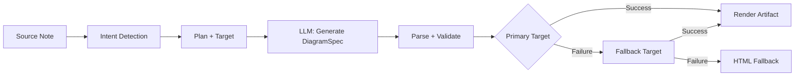
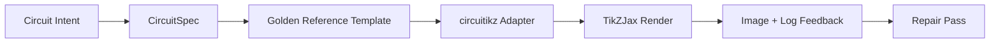

import TLDR from '@site/src/components/TLDR';

# 圖表

<TLDR>
**Notemd 透過以規格為先的處理流程，從您的筆記中產生圖表。** LLM 會產生與渲染器無關的 `DiagramSpec` JSON，之後再由專用的轉換器將其轉換為 Mermaid、JSON Canvas、Vega-Lite、HTML、可編輯的 HTML/SVG、Draw.io、Drawnix，或是受限形式的 circuitikz 输出。該工具支援 9 種意圖類型、自動回退機制、具 SVG/PNG/PDF 匯出功能的即時預覽、語意驗證，以及可增強本地知識的生成功能。
</TLDR>

這是[Obsidian AI知識管理指南](/docs/pillar-ai-knowledge)的一部分。

## 架構：以規格為先的管道流程

Notemd 永遠不會要求 LLM 直接產生 Mermaid/Vega/Canvas 語法。而是：



**為何要先定義規格？** LLM 通常會產生無效的渲染器語法（尤其是 Mermaid）。結構化的 `DiagramSpec` 可在渲染前進行驗證，且同一個規格也可用來作為多個渲染器的備用選項。

## 支援的圖表類型

| 意圖 | 主要渲染器 | 備用方案 | 使用案例 |
|--------|-----------------|-----------|----------|
| `mindmap` | Mermaid | HTML | 階層式主題分解 |
| `flowchart` | Mermaid | HTML | 流程圖、決策樹 |
| `sequence` | Mermaid | HTML | 用戶端-伺服器互動、協定 |
| `classDiagram` | Mermaid | HTML | OOP 類別關係 |
| `erDiagram` | Mermaid | HTML | 資料庫結構、實體關係 |
| `stateDiagram` | Mermaid | HTML | 狀態機、生命週期模型 |
| `canvasMap` | JSON Canvas | Mermaid → HTML | 概念圖、知識圖譜 |
| `dataChart` | Vega-Lite | Mermaid → HTML | 條形圖、折線圖、面積圖、散點圖、餅圖、表格 |
| `circuit` | circuitikz | none | 從經過驗證的 `CircuitSpec` 資料中產生的受限形式電路圖表 |

## 意圖偵測

Notemd 會根據關鍵字分數，從您的筆記內容中判斷出最適合的圖表類型：

| 意圖 | 觸發器 | 自信度 |
|--------|----------|------------|
| `dataChart` | 表格、數字儲存格、指標/趨勢關鍵字、百分比 | 0.88 |
| `sequence` | 請求/回應詞彙表（4個以上匹配項）或 `->`/`=>` 標記 | 0.82 |
| `erDiagram` | 主鍵、外鍵、實體、結構描述（2個以上匹配項） | 0.80 |
| `stateDiagram` | 狀態、轉換中、待處理、執行中、失敗（3 次以上匹配） | 0.76 |
| `flowchart` | 編號步驟（2+）或 if/then/else/工作流程相關術語 | 0.74 |
| `canvasMap` | 概念圖、知識圖譜、空間、群集 | 0.72 |
| `circuit` | circuitikz, TikZJax, circuit, schematic, CMOS, NMOS, PMOS, MOSFET, VDD/GND, `vin`/`vout` | 0.78 |
| `mindmap` | 預設的回退值 | 0.55 |

以**Preferred diagram type**設定、側邊欄選擇器，或明確的命令選單選項來覆寫。

## 渲染目標選擇

這個以規格為先的實驗性流程現在有兩個獨立的控制項：

| 控制 | 設定 | 效果 |
|---------|---------|--------|
| 預設的圖表類型 | `preferredDiagramIntent` | 引導所產生之 `DiagramSpec` 的語意結構 |
| 預設的渲染目標 | `preferredDiagramRenderTarget` | 為 **Generate diagram** 與 **Preview diagram** 選擇工件渲染器 |

若要讓規劃器使用預設值，請將 **Preferred render target** 設定為 **Auto**；否則可明確選擇 Mermaid、JSON Canvas、Vega-Lite、HTML、Editable HTML/SVG、Draw.io、Drawnix 或 Circuitikz。這些控制項屬於一般的圖表設定與側邊欄控制，而非開發者模式下的診斷功能。此覆寫僅適用於產生檔案及預覽相關的指令。標準的 **Summarise as Mermaid diagram** 指令仍會固定產生相容於 Mermaid 的輸出，如此就不會讓現有的 Markdown 工作流程在不知情的情況下改變格式。

這種區分非常重要，因為現在 `flowchart` 意圖可以根據不同的需求被渲染為適用於 Markdown 笔記的 Mermaid 格式、穩定的 HTML 格式、可供後續編輯的 Editable HTML/SVG 格式，或是搭配 SVG 回顧檔案的 Draw.io/Drawnix 源碼檔案。而 `circuit` 意圖則會傳送給 Circuitikz 並需要經過驗證的 `CircuitSpec`；它並非用於產生隨意的 TikZ 文本。
## 使用方式

### 產生圖表

1. 打開筆記
2. 從指令選單執行 **"Notemd: Generate diagram"**
3. Notemd 可偵測意圖、產生規格文件、進行渲染，並儲存最終成果。

**依目標產生的輸出檔案：**

| 目標 | 擴充套件 | 檔名模式 |
|--------|-----------|------------------|
| Mermaid | `.md` | `{note}_summ.md` |
| JSON Canvas | `.canvas` | `{note}_diagram.canvas` |
| Vega-Lite | `.json` | `{note}_diagram.json` |
| HTML | `.html` | `{note}_diagram.html` |
| 可編輯的 HTML/SVG | `.html` | `{note}_diagram.html` |
| Draw.io | `.drawio` + `.drawio.svg` + `.drawio.md` | `{note}_diagram.drawio` 以及相關的回顧檔案 |
| Drawnix | `.drawnix` + `.drawnix.svg` + `.drawnix.md` | `{note}_diagram.drawnix` 以及相關的回顧檔案 |
| Circuitikz | `.tex` + `.tex.svg` + `.tex.md` | `{note}_diagram.tex` 以及相關的回顧檔案 |

### 預覽圖表

1. 執行 **"Notemd: Preview diagram"**
2. 一個模態視窗會隨著渲染完成的圖表而開啟
3. 使用工具列按鈕將其匯出為 SVG、PNG 或 PDF 格式

在設定中可開啟**自動開啟預覽**功能——生成後，預覽視窗會自動顯示。

PNG 與 PDF 的預覽匯出會使用所設定的預覽 PPI 值。預設值為 300 PPI，而高於 600 PPI 的數值會被限制在 600。SVG 則維持向量尺寸。像 `.drawio`、`.drawnix` 和 `.tex` 這樣的原始檔案可以提供一個 `previewSvg` 回顧檔，如此 Obsidian 即可在不將 diagram.net、Drawnix、LaTeX 或 TikZJax 嵌入插件執行環境的情況下，顯示並匯出可供檢視的圖片。

預覽模視窗也包含一個產品瑕疵診斷面板。渲染工具與煙霧測試可以附加 `RenderArtifact.diagnostics`；該模視窗會在預覽旁顯示診斷摘要，列出自訂錯誤、警告及資訊的數量，接著是嚴重性等級、診斷類型、詳細訊息以及修復建議。 在具備診斷功能的歷史記錄中亦會顯示相同的摘要，因此無需逐一開啟每個記錄，即可比較多次執行的 circuitikz 煙霧測試結果。 對於那些雖有原始內容，卻無法以內嵌方式或透過 HTML iframe 路徑進行渲染的產品瑕疵，該模視窗現在會改為僅顯示原始內容的預覽，而非強制使用空的 iframe。如此一來，circuitikz 的編譯/渲染煙霧測試、SVG 文字代碼檢查、PNG 空白螢幕截圖檢查、僅路徑的符號重疊報告，以及未來推出的各種重疊報告，都能有可視化的使用者介面，同時也不會將 TikZJax 或 LaTeX 轉變為必須的插件運行時依賴，或是假裝原始文字已經是經過驗證的視覺渲染結果。

### 舊版 Mermaid 模式

當 `enableExperimentalDiagramPipeline` 關閉時，Notemd 會直接將 Mermaid 提示傳送給 LLM。這樣做完全繞過了規格處理流程。如果實驗性處理流程失敗，系統就會回退到此模式。

## 渲染後端

### Mermaid

6個轉換器（思維導圖、流程圖、序列圖、ER圖、類圖、狀態圖），將 `DiagramSpec` 轉換為 Mermaid 語法。生成後， `mermaid.parse()` 會對輸出結果進行驗證。若驗證失敗：

1. **LLM 重試** — 以 Mermaid 的錯誤訊息作為上下文進行一次嘗試
2. **最小化回退方案** — 由規格節點 ID 所構成的簡化版 Mermaid 圖表

**Legacy Mermaid Fixer** 可自動修復常見的 LLM 語法錯誤：包括 note 指令的標準化、pipe-label 的轉義處理、分號的位置調整、智慧引號、雙連線箭頭、形狀不匹配等問題。

### JSON Canvas

產生具有空間佈局的 Obsidian JSON Canvas 格式：
- 根據深度（x = depth × 420）與索引（y = index × 170）來定位節點
- 寬度根據標籤長度估算
- 包含 `fromSide: 'right'`、`toSide: 'left'`、`toEnd: 'arrow'` 的邊

### Vega-Lite

自動編碼，建立完整的 Vega-Lite v5 JSON 規格文件：
- **笛卡兒圖表**（柱狀/折線/面積/點/散點）：多系列時使用 x + y 通道與顏色
- **Pie**: theta = y（量化），color = x（名義）
- **表格**：列 = x，文字內容 = y + 欄位 = 序列

深色與淺色主題修補程式會在編譯前進行深度合併。

### HTML

通用回退方案。內含完整功能的 HTML 文件，具有：
- CSP meta 標頭
- 透過 `prefers-color-scheme` 切換亮色/暗色模式
- 針對 20 種語言環境的本地化 UI 標籤
- 章節：首頁、結構（節點樹）、關係、說明框、資料系列表格

### 可編輯的 HTML/SVG

用於可編輯匯出工作流程的明確圖形目標。它會將 `DiagramSpec` 轉換為確定的 `SemanticFigureModel`，接著渲染出一個自包含的 HTML 文件，其中包含內嵌的 SVG 群組，並附有 Draw.io 風格的註解：

- 語義節點上的 `data-drawio-type`、`data-drawio-id` 與 `data-drawio-role`
- 語義邊緣上的 `data-drawio-source` 與 `data-drawio-target`
- 經過空白字元標準化與衝突處理後的穩定節點/邊識別碼
- 無腳本、無外部字型，也無遠端資源

此目標目前刻意還不是預設的規劃器路徑。在產品路徑能夠證明其在實際工具中的編輯行為時，它將作為明確的渲染目標提供使用。

### Draw.io 與 Drawnix 導出邊界

目前的實作將第三方編輯器的支援限制在產品檔案的邊界內，同時仍會提供明確的渲染目標：

| 目標 | 合約 | 執行時依賴項目 |
|--------|----------|--------------------|
| Draw.io | 來自 `SemanticFigureModel` 的確定性、未壓縮的 `mxfile` XML，以及用於 SVG/PNG/PDF 校驗的配套檔案 | 在插件執行階段或 CI 環境中均無相關內容 |
| Drawnix | 使用 `geometry` 與 `arrow-line` 元素所構成的最小化 `.drawnix` JSON 子集，以及用於 SVG/PNG/PDF 校驗的配套檔案 | 在插件執行階段或 CI 環境中均無相關內容 |

這種取捨是刻意為之的： Notemd 可以驗證可見的標籤、穩定的 ID 以及受支援的原始資料覆蓋率，而無需將 diagrams.net Desktop、Drawnix、Plait 或僅適用於瀏覽器的編輯器狀態嵌入到插件中。

### circuitikz / TikZJax 方向

電路圖與一般流程圖並非同一類型的問題。電路的正確語法標準通常是 **circuitikz**，透過 TikZJax 之類的插件以 Obsidian 的格式呈現。 TikZJax 可以載入 `circuitikz`、`pgfplots`、`tikz-cd` 和 `chemfig` 這些套件，因此很適用於物理、電路、化學和數學的筆記。

風險在於，由 LLM 生成的原始 TikZ 檔案十分脆弱：

- 複雜的電路拓撲可能在電氣特性上正確，但視覺上難以辨識。
- 重疊的電線與標籤可能會讓正確的網表無法用於製作學習筆記。
- 缺少套件序言、錯誤的參考點，或無效的元件名稱都可能導致無法呈現。
- 渲染器傳回的回饋通常是圖像層級的，而 LLM 則會產生文字層級的幾何資料。

更好的架構應將 circuitikz 视為受限的圖表目標，而非自由形式的提示語：



一等級的模型應分別描述電路拓撲結構與佈局：

| 圖層 | 責任 | 範例 |
|-------|----------------|---------|
| 拓撲結構 | 電氣節點與元件連接 | `VDD -> RD -> drain(M1)`, `source(M1) -> GND` |
| 佈局 | 網格佈置、方向、導航車道 | `M1 at (3,2.2)`，輸入在左，輸出在右 |
| 風格 | 包裝、電壓規範、標籤、固定點 | `\begin{circuitikz}[american voltages]` |
| 驗證 | 編譯日誌，缺少參考點，重疊/螢幕截圖檢查 | TikZJax/LaTeX 診斷功能與視覺檢視 |

### 目前的 circuitikz 原型

Notemd 現在已包含此方向的第一個受限儲存庫原型。它刻意設定為離線狀態且受模板限制：

```bash
npm run diagram:export-circuitikz -- --input cmos-inverter.json --output cmos-inverter.tex
```

此原型加入了一個受限制的 `CircuitSpec`邊界，並為六種黃金參考類別提供了確定性的匯出功能：

在這個實驗性的圖表處理流程中，現在也可以透過 `intent: "circuit"` 與渲染目標 `circuitikz` 來達成相同效果。所生成的 `DiagramSpec` 只有在處理電路相關的意圖時才會內嵌 `circuitSpec`。`CircuitikzRenderer` 會寫入相同的確定性 `.tex` 源碼，並附加一個根據經過驗證的電路拓撲所產生的 SVG 預覽檔案，從而實現在 Obsidian 中的預覽功能以及 SVG/PNG/PDF 的匯出。該預覽檔並非 LaTeX/TikZJax 的編譯結果；真正的渲染結果仍屬於下方那些明確指定的測試指令。

對於受支援的黃金模板而言，`layoutHints.inputSide` 與 `layoutHints.outputSide` 仍然僅用於展示目的。它們可以調整確定性的輸入/輸出端點位置，但無法改變拓撲結構的簽名，也不允許透過修復流程來重新連接電路。

| 電路類型 | 金色參考手冊 | 目前的保固期 |
|--------------|------------------|-------------------|
| `common-source-amplifier` | `common-source-nmos-v1` | 在撰寫 LaTeX 之前，會先驗證 `VDD -> R_D -> M1.D`、`vin -> M1.G`、`M1.S -> GND` 與 `M1.D -> vout`。 |
| `cmos-inverter` | `cmos-inverter-v1` | 在撰寫 LaTeX 之前，會先驗證 PMOS-over-NMOS 構型、共享閘極輸入、共享漏極輸出、`VDD -> MP.S` 與 `MN.S -> GND`。 |
| `cmos-buffer` | `cmos-buffer-v1` | 在撰寫 LaTeX 之前，會先驗證兩個串聯的反相器階段、中間節點 `vmid`、已恢復的 `vout`，以及共用的 VDD/GND 接地線。 |
| `cmos-transmission-gate` | `cmos-transmission-gate-v1` | 在寫入 LaTeX 之前，會以補碼形式的 `phib` / `phi` 控制，驗證 `vin` 與 `vout` 之間的平行 PMOS/NMOS 過濾元件是否有效。 |
| `cmos-nand2` | `cmos-nand2-v1` | 在寫入 LaTeX 之前，會先驗證並聯的 PMOS 上拉電路、串聯的 NMOS 下拉電路、雙輸入 `va` / `vb`，以及 `vout`。 |
| `cmos-nor2` | `cmos-nor2-v1` | 在寫入 LaTeX 之前，會先驗證串聯式 PMOS 上拉、並聯式 NMOS 下拉、雙輸入 `va` / `vb` 以及 `vout` 的功能。 |

這並非一個通用的 TikZ 產生器。它不接受任意的 TikZ 檔案、不會編譯 LaTeX、不會呼叫 TikZJax、不在插件執行階段檢視螢幕截圖，也不會執行自動化的圖像回饋修復功能。這些功能都屬於後續的階段。

Preview diagram 指令在檔案副檔名為 `.tex` 或 `.tikz`，且原始碼包含 `\usepackage{circuitikz}` 或 `\begin{circuitikz}` 時，可直接重新開啟已儲存的 circuitikz 原始碼檔案。此方式屬於僅顯示原始碼的 circuitikz 預覽模式：視窗會顯示原始碼、診斷資訊、複製/儲存控制項以及歷史記錄元資料，但不會在插件執行期間編譯 LaTeX 或呼叫 TikZJax。

現在，相同的僅來源預覽範圍已涵蓋已儲存的 Draw.io 與 Drawnix 產物。當 `.drawio` 檔案呈現為 Draw.io XML（`mxfile` 或 `mxGraphModel`）的形態時即會被接受，而 `.drawnix` 檔案則在為 Drawnix JSON 且包含 `type: "drawnix"` 與 `elements` 陣列時才會被接受。此外掛程式仍不會內嵌 diagrams.net 或 Drawnix 白板主機；這些預覽僅展示來源碼、診斷資訊及產物歷史記錄，並未提供內建的可視化編輯器。

若要進行保持拓撲結構的修復，請在接納修復後的候選結果之前，將修復前的規格作為參考傳入：

```bash
npm run diagram:export-circuitikz -- --input repaired-cmos-inverter.json --topology-reference cmos-inverter.json --output cmos-inverter.tex
```

修復保護機制會在使用輸出結果之前，透過 `createCircuitTopologySignature` 與 `assertCircuitTopologyUnchanged` 來比對 `circuitKind`、`goldenReferenceId`、網路、元件識別碼/類型/端點，以及無向連線的端點。標籤、標題文字、佈局提示、連線順序和連線標籤皆會被刻意忽略。若某個候選方案添加了過短的連線或重新接續了端點，則在 `.tex` 檔案被寫入之前就會因 `Circuit topology drift detected` 而失敗。

CLI 現在已能解析現有的 LaTeX/TikZJax 編譯日誌，且無需執行編譯器：

```bash
npm run diagram:export-circuitikz -- --input cmos-inverter.json --output cmos-inverter.tex --compile-log cmos-inverter.log --diagnostics-output cmos-inverter.diagnostics.json
```

此診斷路徑會報告缺失的套件，例如 `circuitikz.sty`，以及未知的 TikZ/circuitikz 關鍵字；還會顯示 TikZ 路徑語法錯誤，如缺少分號、因括號不平衡或標籤未結束而產生的多餘參數、未定義的控制序列、一般性的 LaTeX 錯誤、緊急停止狀況，以及提示性過滿的 `\hbox` 警告。它仍以日誌為主：本地的 LaTeX/TikZJax 執行與螢幕截圖品質檢查仍屬於未來要處理的獨立任務。

用於維護人員的簡易測試時，相同的 CLI 可選擇性地在不進行殼層指令解析的情況下，執行明確設定的渲染器：

```bash
npm run diagram:export-circuitikz -- --input cmos-inverter.json --output cmos-inverter.tex --compile-executable pdflatex --compile-arg -interaction=nonstopmode --compile-arg -halt-on-error --compile-arg -output-directory={outputDir} --compile-arg {tex} --expected-artifact {outputDir}/{jobName}.pdf
```

編譯執行器會使用 `shell: false`，將 `{tex}`、`{outputDir}` 與 `{jobName}` 這些佔位符轉換為參數陣列的值，讀取所產生的 `{jobName}.log`，並在 CLI JSON 的輸出中返回 `compileExecution` 以及 `compileDiagnostics`。 `--compile-executable` 只是渲染器二進位檔或封裝檔的路徑；渲染器旗標則應放在重複的 `--compile-arg` 值中。空的可執行檔會以 `compile-executable-invalid` 的方式失敗，缺失的二進位檔會以 `compile-executable-not-found` 的方式失敗，而呈現為殼層指令形式的可執行檔字串則會被建議拆分參數，如此 Windows、Linux 與 macOS 才能遵循相同的直接執行規範。透過 `--expected-artifact`，它還會報告 `compileExecution.renderSmoke`，若渲染器無法產生非空的成果檔，則會讓 CLI 失敗。它仍然不會內建 LaTeX、將 TikZJax 轉為插件運行時的依賴項，也不會進行螢幕截圖層級的視覺修復。

如果預期的產物是 `.svg`，那麼煙霧測試會再深入一層：

```bash
npm run diagram:export-circuitikz -- --input cmos-inverter.json --output cmos-inverter.tex --compile-executable dvisvgm --compile-arg ... --expected-artifact {outputDir}/{jobName}.svg --expected-svg-text v_{in} --expected-svg-text v_{out}
```

SVG smoke 會驗證 `<svg>` 根元素、正值尺寸或 `viewBox`，在排除隱藏/透明元素後至少仍有一個可見的繪圖元素，任何要求的文字代碼，位於 `viewBox` 外的可見元素，位置重疊的明顯 `<text>` / `<tspan>` 標籤，以及透過 `render-svg-label-overlap` 而與繪圖元素重疊的明顯文字標籤。預期的文字會在可見文字中搜尋，並解碼如 `aria-label`、`<title>` 和 `<desc>` 這類無障礙性元資料，如此一來，那些能在可見 `<text>` 范圍外保留語意標籤的渲染器，仍可在不依賴 OCR 的情況下通過文字代碼的 smoke 測試。現在的幾何檢查會考慮常見群組與元素 `transform` 屬性所帶來的變換效果，因此經過轉換、縮放、旋轉、傾斜或矩陣變換的 SVG 方框都會在變換合併之後被檢查。它涵蓋了 A/a 槓端點的精確弧線範圍、C/S/Q/T 曲線端點的精確貝氏曲線範圍、考慮筆觸寬度的 SVG 範圍及標籤重疊檢查、`polyline` / `polygon` 繪圖幾何形狀，同時也會根據 `<use href="#...">` 參考資料解決僅由路徑構成的字型位置問題，如此一來，即使轉換後的字型幾何形狀超出了 `viewBox` 的範圍，仍可能無法通過有限畫布範圍的檢查。位於同一個 `<text>` 父元素下的多個 `tspan` 標籤會被視為不同的標籤方框進行比對，這樣就能偵測到原本可能會將多個獨立標籤合併為一個文字節點的 LaTeX 風格 SVG 輸出。定位的 SVG `text` 和 `tspan` 方框會遵守 `text-anchor` 的值 `start`、`middle` 和 `end`，因此居中或右對齊的標籤仍可觸發文字/文字之間以及標籤與繪圖之間的重疊診斷，而不需要依賴瀏覽器級的文字排版功能。位於 `<defs>` 內僅用於定義的字型路徑不會被視為可見的繪圖元素，但它們自身的定義內部 `transform` 屬性仍會在 `<use>` 放置之前被套用，如此一來經過縮放或鏡像處理的字型定義也不會被少計。標籤與繪圖的檢查會使用一定的繪圖方框容差以及所宣告的 `stroke-width`，因此細線、粗線以及多邊形組件輪廓，只要其可見筆觸達到標籤位置，都可能被視為影響標籤可讀性的因素。從 `<use href="#...">` 解析而來的僅由路徑構成的字型標籤也會與繪圖方框進行比對，若可重用的字型幾何形狀與線條或組件重疊，就會以 `render-svg-path-glyph-overlap` 為由失敗。如果某渲染器將標籤轉換為可重用的路徑字型，而非可搜尋的 `<text>`，且未保留無障礙性元資料，則 smoke 報告會記錄 `pathOnlyGlyphUseCount`，並透過 `render-svg-text-path-only` 使要求的文字代碼檢查失敗，而非假裝該標籤根本不存在。其他失敗情況則會透過 `render-svg-invalid`、`render-svg-dimension-missing`、`render-svg-no-visible-elements`、`render-svg-text-missing`、`render-svg-out-of-bounds`、`render-svg-text-overlap`、`render-svg-label-overlap` 或 `render-svg-path-glyph-overlap` 來報告。對於那些能將標籤保留為可搜尋的 SVG 文字或無障礙性元資料的渲染器而言，文字代碼及重疊檢查應僅被視為結構性的 smoke 測試；而僅由路徑構成的 SVG 輸出仍需要後續的截圖/OCR 驗證來證明標籤的視覺可讀性，且此 smoke 測試也不會聲稱已完整覆蓋所有 SVG 路徑。

在計算可見元素數量及收集幾何資訊時，隱藏的 SVG 群組和元素會一致地被跳過。屬性或內聯樣式 `display:none`、`visibility:hidden`、`visibility:collapse`，以及整體的 `opacity:0` 都無法讓本應為空的渲染結果通過可見輸出的測試。

僅包含路徑的圖形定義可以是直接的路徑，或是位於 `<defs>` 內的群組/符號容器。在 `<use>` 安置之前，煙霧過濾步驟會先從 `<g id="...">` 和 `<symbol id="...">` 解析出子路徑的幾何資訊，因此經過包裝的圖形輸出仍會傳送給 `pathOnlyGlyphUseCount`、界限畫布檢查以及 `render-svg-path-glyph-overlap`。

路徑解析器也會追蹤子路徑的起始點，並在 `Z/z` 處重設目前的位置，如此一來，在封閉的子路徑之後的相對指令就能從正確的 SVG 位置繼續執行，而不會產生錯誤的 `render-svg-out-of-bounds` 診斷結果。

相同的幾何處理步驟會遵循 SVG 數字格式規則，包括小數點前的點號以及明確的加號，因此像 `.5`、`-.5` 或 `+.5` 這樣的簡潔 dvisvgm 座標在範圍檢查時仍保持分數形式，而不會變成錯誤的越界幾何資料或被跳過。

如果渲染器產生 `.png`，相同的預期輸出路徑就會成為第一張截圖的檢查對象： Notemd 可解碼非隔行式的 1/2/4/8 位元索引顏色 PNG 檔案、1/2/4/8/16 位元灰階 PNG 檔案，以及 8/16 位元灰階-α/RGB/RGBA PNG 檔案。索引顏色及次位元灰階影像支援封裝樣本；索引顏色影像還支援 PLTE 與可選的 tRNS 數據；灰階/RGB 影像則支援用於透明樣本的 tRNS 數據。16 位元的直接樣本會被轉換為與煙霧檢查所使用的相同 8 位元 RGBA 比較空間。此煙霧檢查會驗證正確的尺寸，將前景範圍記錄為 `foregroundBounds`，並將該範圍內的前景密度記錄為 `foregroundDensity`；若所有可見像素都與左上角的背景顏色相同則會以 `render-png-blank` 為失敗原因，若前景內容觸及影像邊界則以 `render-png-content-clipped` 為失敗原因，若大型截圖中的前景像素少於四個則以 `render-png-foreground-too-small` 為失敗原因，若在非簡單的範圍框內前景像素密度異常高則以 `render-png-foreground-dense` 為失敗原因。不支援的 PNG 格式會以 `render-png-unsupported` 為失敗原因，並提供針對 Adam7 隔行式 PNG 或不支援的索引顏色位元深度的格式特定說明。此方法能偵測出空白截圖、明顯的畫布裁切、渲染不足的前景區域、第一層像素級的擁擠問題，以及錯誤的渲染器 PNG 導出設定，且無需依賴特定平台的指令行工具。它目前還不具備 OCR 級別的標籤辨識、精確的文字重疊檢測，或能保留圖像拓撲結構的修復功能。

當診斷結果顯示編譯或 render-smoke 執行失敗時，CLI 也可以撰寫一份能保留拓撲結構的修復說明：

```bash
npm run diagram:export-circuitikz -- --input cmos-inverter.json --topology-reference cmos-inverter.json --output cmos-inverter.tex --compile-log cmos-inverter.log --repair-brief-output cmos-inverter.repair-brief.json
```

修復說明文件使用結構 `notemd.circuitikz.repair-brief.v1`，並包含來源 `CircuitSpec`、拓撲簽章、編譯/渲染診斷結果、允許的編輯內容、禁止的拓撲編輯、後續驗證步驟，以及結構化的 `repairPrompt`。提示詞的角色為 `topology-preserving-circuitikz-repair`；其 `diagnosticFocus` 清單是根據編譯/渲染診斷結果所產生，而其 `acceptanceCriteria` 則需要對候選方案進行驗證，並執行新的編譯與渲染測試。這是一種用於後續修復循環的資料傳遞格式，並不代表 Notemd 已經能夠自動執行視覺修復功能。

在產生修復建議後，相同的 CLI 可以在撰寫輸出結果之前，根據說明文件對其進行驗證：

```bash
npm run diagram:export-circuitikz -- --input repaired-cmos-inverter.json --repair-brief cmos-inverter.repair-brief.json --output repaired-cmos-inverter.tex
```

`--repair-brief` 會根據簡報中的候選拓撲簽名進行檢查，且與 `--topology-reference` 互斥。通過此階段僅能證明拓撲結構已得到保留；候選方案仍需經過編譯診斷及 render-smoke 檢查。

`--repair-brief` 的結果還包含具有 `notemd.circuitikz.repair-acceptance.v1` 構架的 `repairAcceptance` 證據。它會將 `topology-signature`、`compile-diagnostics` 和 `render-smoke` 關卡標記為 `passed`、`failed` 或 `missing`；揭露 `remainingChecks`；並在候選執行過程未包含所有必要證據之前，保持 `readyForVisualAcceptance` 為假。

當 CI 或版本發布的證據需要一個耐久的 JSON 檔案時，請搭配使用 `--repair-acceptance-output` 與 `--repair-brief`：

```bash
npm run diagram:export-circuitikz -- --input repaired-cmos-inverter.json --repair-brief cmos-inverter.repair-brief.json --output repaired-cmos-inverter.tex --repair-acceptance-output repaired-cmos-inverter.repair-acceptance.json
```

若需版本發布或維護者相關的證明，請將所有受支援的 golden family 透過 aggregate fixture runner 執行：

```bash
npm run diagram:smoke-circuitikz -- --output-dir docs/export/circuitikz-smoke --compile-executable pdflatex --compile-arg -interaction=nonstopmode --compile-arg -halt-on-error --compile-arg -output-directory={outputDir} --compile-arg {tex} --expected-artifact {outputDir}/{jobName}.pdf
```

該執行程式會使用 `docs/maintainer/fixtures/circuitikz/common-source-nmos-v1.json`、`docs/maintainer/fixtures/circuitikz/cmos-inverter-v1.json`、`docs/maintainer/fixtures/circuitikz/cmos-buffer-v1.json`、`docs/maintainer/fixtures/circuitikz/cmos-transmission-gate-v1.json`、`docs/maintainer/fixtures/circuitikz/cmos-nand2-v1.json` 與 `docs/maintainer/fixtures/circuitikz/cmos-nor2-v1.json`，對每個測試裝置呼叫相同的無殼層匯出路徑，並回傳一份包含每個測試裝置的 `compileExecution` 與 `compileDiagnostics` 資料的綜合 JSON 報告。它仍屬於維護者用命令，而非外掛程式的運行時依賴項目。

當維護用機器尚未配置渲染器時，執行不含 `--compile-executable` 的相同固定裝置命令，並明確儲存環境閘道：

```bash
npm run diagram:smoke-circuitikz -- --output-dir docs/export/circuitikz-smoke --report-output docs/export/circuitikz-smoke/renderer-availability.json
```

該路徑仍會寫入確定的固定資產 `.tex` 相關檔案，但會傳回 `ok: false`，且 `rendererAvailability.status` 被設定為 `missing-configuration`，同時附有 `compile-executable-invalid` 的診斷資訊。僅將其視為渲染器可用性的證據；它並非用於編譯、render-smoke 測試或視覺驗收。

### 金色參考提示詞形狀

對於短期使用，請在要求不同的電路變體之前，先提供一個可呈現的黃金參考版本。受限的提示詞應保留前言、座標比例、定位樣式以及佈線規範：

```latex
\usepackage{circuitikz}
\begin{document}
\begin{circuitikz}[american voltages]
\draw
  (3,5) node[vcc]{$V_{DD}$}
  to [R, l=$R_D$] (3,3)
  to [short, *-o] (5,3) node[right]{$v_{out}$}
  (3,3) to [short] (3,2.2)
  node[nmos, anchor=D] (M1) {$M_1$}
  (M1.S) to [short] (3,0.5)
  node[ground]{}
  (M1.G) to [short, -o] (0.8,2.2)
  node[left]{$v_{in}$};
\draw
  (3,0.5) node[below right]{$S$};
\end{circuitikz}
\end{document}
```

對於 CMOS 反相器，提示語應要求明確的拓撲結構與佈局限制，而非僅要求「繪製一個 CMOS 反相器」：

- 將 `VDD` 保持在最上方，`GND` 保持在最下方，輸入在左側，輸出在右側；
- 在 `nmos` 上方使用 `pmos`，並採用共享閘極與共享漏極的結構；
- 將輸出節點保持在漏極接合處，並以 `*-o` 標記它。
- 使用命名錨點（`PM1.G`、`NM1.G`、`PM1.D`、`NM1.D`）來取代視覺上推斷出的座標。
- 除非電氣上有所需要，否則應避免使用對角線或交叉的電線。

### 目前的進度與後續階段

| 面積 | 目前狀態 | 下一步動作 |
|------|----------------|-----------|
| 一般圖表 | 已為 Mermaid、JSON Canvas、Vega-Lite、HTML 實作以規格為優先的管道流程 | 持續擴展語意驗證的覆蓋範圍 |
| 可編輯的圖表 | 已實作 `editable-html-svg`、Draw.io XML 以及 Drawnix JSON 的工件邊界。 | 只有在測試證明可編輯之後，才加入更豐富的原始資料型態。 |
| CLI 支援 | `npm run diagram:export-artifact` 可從一個已驗證的 `DiagramSpec` 中匯出可編輯的 HTML/SVG、Draw.io、Drawnix、Circuitikz，以及 SVG/PNG/PDF 格式的審核憑證 | 當有新的目標版本發布時，會新增針對該目標的測試用例 |
| circuitikz | `DiagramSpec(intent: "circuit", circuitSpec) -> CircuitikzRenderer -> circuitikz` 可匯出常用電路、CMOS 開關、`cmos-buffer` / `cmos-buffer-v1`、`cmos-transmission-gate` / `cmos-transmission-gate-v1`、`cmos-nand2` / `cmos-nand2-v1` 與 `cmos-nor2` / `cmos-nor2-v1` 的參考模板，且在不開啟開發者模式的前提下即可顯示 UI 意圖與渲染目標選項，同時會產生 TeX 代碼以及 SVG/PNG/PDF 格式的預覽檔案，在輸出前會先驗證電路拓撲結構、解析編譯日誌，能夠執行明確指定的本地渲染器並搭配 `--expected-artifact` 參數使用，此外還提供僅包含原始程式碼的備用方案，且可透過 `RenderArtifact.diagnostics` 與預覽模態視窗查看預覽相關的診斷資訊 | 將為僅包含路徑的視覺文字加入 OCR 級別的標籤辨識功能、更精確的像素級重疊檢查、在必要時擴大 SVG 路徑的覆蓋範圍，僅在仍可保持選用性的情況下才自動安裝或探索適用的渲染器，並實現自動化的、能保留拓撲結構的修復功能 |
| TikZJax 整合 | 用於 Obsidian 端顯示的候選渲染主機 | 保持其為選用項；不要讓 TikZJax 成為必須的插件運行時依賴。 |

## 設定

| 設定 | 預設值 | 效果 |
|---------|---------|--------|
| `enableExperimentalDiagramPipeline` | `false` | 在以規格為先與舊版模式之間切換 Mermaid |
| `experimentalDiagramCompatibilityMode` | `'legacy-mermaid'` | `'legacy-mermaid'` 只能是 Mermaid；`'best-fit'` 為原生目標加上備用選項 |
| `preferredDiagramIntent` | `undefined`（自動） | 覆寫自動意圖偵測功能 |
| `preferredDiagramRenderTarget` | `undefined` (自動) | 覆寫元件渲染器，包括 Draw.io、Drawnix 與 Circuitikz |
| `summarizeToMermaidLanguage` | `'en'` | 圖表標籤的目標語言 |
| `summarizeToMermaidProvider` / `Model` | DeepSeek | 每個任務的 LLM 用於圖表生成 |
| `autoMermaidFixAfterGenerate` | （來自常數） | 在 Mermaid 的輸出上自動執行舊版修復工具 |
| `enableLocalKnowledgeForDiagramGeneration` | `false` | 以本地金庫的知識來增強來源資料。 |

### 本地知識增強

啟用後，Notemd會從您的保險庫本地知識庫（基於MiniSearch）中取得相關的上下文片段，並將其加在原始Markdown文件的前面。該增強提示中寫明：「僅作參考之用；請保持主要結構與原始筆記一致。」

### 相容模式

- **`legacy-mermaid`**：所有意圖都會傳送至 Mermaid。非 Mermaid 意圖（canvasMap、dataChart）將被強制轉發至 `flowchart` 或 `mindmap`。沒有備用處理鏈路。
- **`best-fit`**：每個意圖都會傳送至其對應的原始目標。若主要目標失敗，則會沿著備用鏈路繼續傳送（例如：Vega-Lite → Mermaid → HTML）。

## 預覽與匯出

| 動作 | 方法 |
|--------|--------|
| SVG export | Canvas 用 `mermaid.render()` / `vega.View.toSVG()` / SVG 构建工具 |
| PNG 導出 | SVG -> 圖像 -> 在設定的 PPI 下的 Canvas / 預覽光柵化處理器 -> PNG ArrayBuffer |
| PDF 導出 | SVG → 在設定的 PPI 下的光柵圖像 → 單頁 PDF |
| 儲存來源 | 以目標特定的副檔名儲存的原始工件內容 |
| 僅來源預覽 | 非內聯的工件，其原始內容以程式碼形式顯示並附上診斷資訊，且不會透過 iframe 來呈現 |
| 意義審核 | 由 `scripts/diagram-semantic-verification.js` 以及渲染器/CLI 測試，對 Mermaid、JSON Canvas、Vega-Lite、可編輯的 HTML/SVG、Draw.io、Drawnix 與受限版的 Circuitikz 進行檢查 |

**快取**：RenderCache 使用 `{spec, target, theme}` 的確定性 JSON 金鑰。在處理過程中的去重機制可避免重複產生渲染結果。

## 技巧

- **從 `best-fit` 模式開始**——它能為每種意圖類型產生最佳的視覺輸出
- **運用強大的模型處理複雜的圖表** — 流程圖和 ER 圖能從 GPT-4o 或 Claude 中獲益
- 為領域特定的圖表**啟用本地知識**——相關的保險庫上下文可提升準確度
- **設定 `autoMermaidFixAfterGenerate`** — 若沒有它，Mermaid 的語法錯誤就很容易出現
- **舊版修復工具相當全面** — 如果 Mermaid 的預覽失敗，手動執行修復命令通常就能解決問題

---

## 接下來的步驟

- 🔗 [Wiki-連結](./wiki-links) — 概念如何以內聯方式相互連結
- 📝 [概念筆記](./concept-notes) — 提取用於圖表原始資料的各項概念
- 🔍 [研究](./research) — 以網路取得的資料來增強圖表
