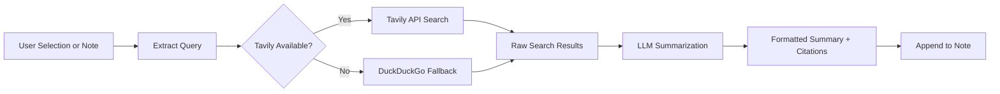

import TLDR from '@site/src/components/TLDR';

# 研究與網路搜尋

<TLDR>
**Notemd 會上網搜尋，並將經 LLM 總結的結果直接插入您的筆記中。** Tavily API 是主要的搜尋後端；DuckDuckGo 則作為無需設定的備用選項。結果會附上出處引用並以 `## Research` 標題呈現在下方。支援單筆筆記研究、批次資料夾研究，以及為總結步驟選擇不同的模型。

這是[Obsidian AI知識管理指南](/docs/pillar-ai-knowledge)的一部分。
</TLDR>

## 概覽

Research 是 Notemd 最強大的整合功能之一：它將閱讀、搜尋與撰寫這三個步驟串聯起來。您不必切換到瀏覽器去查詢不熟悉的詞彙，只需將其標出，讓 Notemd 進行搜尋、摘要整理並附加結果——所有操作都在您的資料庫內完成。

此流程可完全自訂。您可以選擇搜尋供應商、用於撰寫摘要的 LLM，以及決定結果是要附加到目前的筆記中，還是寫入獨立的檔案中。批次模式讓您只需一鍵即可對資料夾中的所有筆記進行查詢。

## 它的運作原理是什麼

### 搜尋後摘要化流程



1. **查詢提取** -- Notemd 會從您的選項或筆記標題中提取搜尋詞彙。
2. **網路搜尋** -- 會先嘗試 Tavily。如果未設定 API 金鑰，則會自動使用 DuckDuckGo（不需要金鑰）。
3. **LLM 摘要生成** -- 原始搜尋結果會被傳送至已設定的 LLM，由其產生並附上內文引用資料的簡潔摘要。
4. **Append** -- 格式化後的摘要會被附加在活躍筆記中的 `## Research` 標題下方。

### Tavily 與 DuckDuckGo 的比較

| 面向方面 | Tavily | DuckDuckGo |
|--------|--------|------------|
| API 金鑰 | 必須（提供免費方案） | 不需要 |
| 結果品質 | 更高階（專為人工智慧打造） | 適用於一般查詢 |
| 速率限制 | 豐厚的免費方案 | 可能會受到流量限制 |
| 設定 | 設定中的 `tavilyApiKey` | 零配置 -- 自動回退 |

### 批次資料夾研究

在資料夾上按右鍵，然後選擇 **“Notemd: Research folder”**。資料夾中的每個 `.md` 檔案都會依序被處理（或根據所設定的同時處理數量以平行方式處理）。每則筆記都會獲得其獨有的研究摘要。

## 設定

| 設定 | 預設值 | 效果 |
|---------|---------|--------|
| `tavilyApiKey` | `''` | Tavily API 金鑰。若為空，則僅使用 DuckDuckGo。 |
| `researchProvider` / `researchModel` | DeepSeek | 每個任務的 LLM 用於摘要化搜尋結果 |
| `maxResearchContentTokens` | `4000` | 傳送至 LLM 的內容的 Token 預算。超出的部分會被截斷。 |
| `researchAppendToNote` | `true` | 將摘要附加到原始筆記中。若設定為 false，則會建立一個獨立的檔案。 |
| `researchLanguage` | `'en'` | 摘要研究的輸出語言 |

### 每任務模型推薦

研究能從能處理多語言內容並產出結構良好的散文模型中受益。請考慮：

- **DeepSeek** -- 預設型號，性價比高，品質優良
- **GPT-4o** -- 更高品質的摘要功能，但成本也更高
- **Gemini Flash** -- 快速且價格低廉，適合處理簡單的查詢任務

## 範例

你正在閱讀一篇關於*transformer注意力機制*的論文，遇到了一個不熟悉的術語：*相對位置編碼*。而非留下 Obsidian:

1. 標出 **「相對位置編碼」**
2. 按右鍵 --> **"Notemd: 研究並總結"**
3. Notemd 會在網路上搜尋，總結最優秀的結果，並附加：

```markdown
## Research

### Relative Positional Encoding

Relative positional encoding is a method used in transformer models
where positional information is expressed as relative distances between
tokens rather than absolute positions. Introduced by Shaw et al. (2018),
it improves generalization to unseen sequence lengths compared to
absolute encodings (Vaswani et al., 2017).

Sources:
- [Shaw et al., Self-Attention with Relative Position Representations (2018)](https://arxiv.org/abs/1803.02155)
- [Transformer Positional Encoding Overview](https://example.com/transformer-pos-enc)
```

摘要現在已儲存在您的保險庫中，可搜尋、可建立連結，且可在離線狀態下存取。

## 技巧

- **設定 Tavily 金鑰以獲得最佳結果** -- 就連免費方案所提供的相關性也優於原始的 DuckDuckGo。
- **使用功能強大的摘要模型** -- 廉價的模型可能會簡化細膩的技術內容。
- 在初步瀏覽之後進行**批次研究**，一次填補多份筆記中的空白。
- **檢視附加的摘要** -- LLMs 可能會產生對來源詳細資料的錯誤描述，請驗證其中的關鍵主張。

---

## 接下來的步驟

- [概念說明](./concept-notes) -- 從研究結果中提取並儲存關鍵詞彙
- [Wiki-Links](./wiki-links) -- 在您的資料庫中連結各種研究所得的概念
- [翻譯](./translation) -- 將研究摘要翻譯成其他語言
- [LLM 提供商](/docs/providers/overview) -- 設定用於摘要生成的模型
