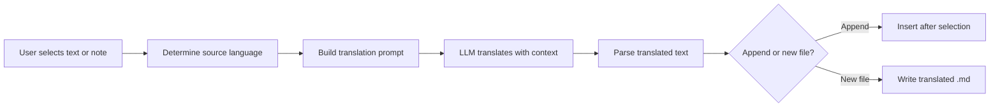

import TLDR from '@site/src/components/TLDR';

# 翻譯

<TLDR>
**Notemd** 可透過 LLM 提供的翻譯技術，將文字在 21 種以上語言之間進行轉換。它支援單項選擇翻譯、整篇內容翻譯以及批次資料夾翻譯。每個翻譯任務皆可透過專屬的設定，選用不同的供應商與模型。輸出語言可獨立於 UI 語言進行設定。根據您的需求，結果可被附加到原有文件中，或寫入新的檔案中。

這是[Obsidian AI知識管理指南](/docs/pillar-ai-knowledge)的一部分。
</TLDR>

## 概覽

在 Notemd 中的翻譯並非透過字典查詢完成——而是由 LLM 驅動、具備上下文感知能力的翻譯。模型能夠完整閱讀整段文字或筆記，從而保留原文的語氣、領域專有術語及句子結構。這種方式能產出比逐句翻譯服務更優質的結果，尤其適用於技術、學術及創意寫作領域。

此功能支援三種範圍：選取內容、目前編輯的筆記，以及整個資料夾。結合每個任務的模型選擇機制，您可以在不更換全局供應商的情況下，使用快速模型（Gemini Flash）進行簡單翻譯，或使用強大模型（Claude Sonnet）處理需要細膩表達的內容。

## 它的運作原理是什麼

### 翻譯指令



1. **來源偵測** -- LLM 會根據內容推斷出來源語言，您無需手動指定。
2. **提示詞構建** -- Notemd 會建立一個包含目標語言、可選的領域提示，以及待翻譯內容的提示詞。
3. **LLM 翻譯** -- 已設定的 `translateProvider` / `translateModel` 會處理該請求。此模型能保留 Markdown 格式、維基連結以及程式碼區塊。
4. **輸出** -- 翻譯後的文字會附加在原始內容下方，或寫入金庫中的新檔案中。

### 語言對組

Notemd 可支援底層 LLM 所支援的任何語言組合。常見的組合包括：

| 來源 | 目標 | 典型品質 |
|--------|--------|----------------|
| 英文 | 簡體中文 | 非常出色 |
| 中文 | 英文 | 非常出色 |
| 英文 | 日文 | 非常好 |
| 英文 | 德語 / 法語 / 西班牙語 | 非常好 |
| 任何受支援的 | 任何受支援的 | 模型相依性 |

`translateLanguage` 的設定用來控制**輸出語言**。原始語言會自動偵測。

### 每任務模型選擇

翻譯品質會因模型而異。 Notemd 可讓您專為翻譯任務指定特定的模型：

| 模型 | 速度 | 品質 | 成本 | 最適用於 |
|-------|-------|--------|------|----------|
| `gemini-2.0-flash-exp` | 快速 | 不錯 | 低 | 隨意、高產量 |
| `gpt-4o-mini` | 快速 | 不錯 | 低 | 快速查詢 |
| `deepseek-chat` | 中號 | 不錯 | 非常低 | 預算多語言版 |
| `claude-3-5-sonnet` | 中號 | 非常出色 | 中號 | 技術 / 學術 |
| `gpt-4o` | 中號 | 非常出色 | 中號 | 注重細微差異的散文 |

### 批次資料夾翻譯

在資料夾上按右鍵，選擇 **"Notemd: Translate folder"** 即可翻譯該資料夾中的所有筆記。每個檔案都會被獨立處理。併發設定用來控制同時翻譯的檔案數量。

## 設定

| 設定 | 預設值 | 效果 |
|---------|---------|--------|
| `translateProvider` / `translateModel` | DeepSeek | 專門用於翻譯任務的供應商 |
| `translateLanguage` | `'en'` | 目標輸出語言 |
| `translationAppendToNote` | `true` | 在原文下方附加翻譯內容。若為 false，則建立新檔案。 |
| `batchConcurrency` | `3` | 批次翻譯期間同時處理的檔案數量 |

## 範例

您正在閱讀一份中文研究報告，並希望獲得其英文版本：

1. 打開筆記
2. 按右鍵 --> **"Notemd: 翻譯目前檔案"**
3. Notemd 會偵測中文，並翻譯成您所設定的目標語言（英文），然後附加：

```markdown
## Translation (English)

The experimental results show that the proposed method achieves
a 12% improvement in F1 score compared to the baseline, primarily
due to the enhanced feature extraction module described in Section 3.
```

原始的中文內文就位於翻譯之上，未作任何改動。`## Translation` 標題讓兩個版本能存在同一個檔案中，以便查閱。

## 技巧

- **使用 Gemini Flash 進行大量資料處理** -- 這是對大型資料夾進行批次翻譯時最快且最便宜的選項。
- **保留維基連結** -- Notemd 的指示要求 LLM 在翻譯時保持 `[[wiki-links]]` 完整不變。翻譯完成後請加以驗證，因為有些模型有時會將其解包。
- **明確設定輸出語言** -- 來源語言可自動偵測，但請務必設定 `translateLanguage`，以避免對目標語言產生歧義。
- **批次翻譯概念說明文件** -- 若您的概念資料夾是某種語言，而您需要它轉換為另一種語言，則可透過資料夾層級的翻譯功能一步完成。

---

## 接下來的步驟

- [研究](./research) -- 以任何語言進行搜尋與摘要整理，再翻譯結果
- [工作流程](./workflows) -- 透過維基連結或概念抽取進行串聯翻譯
- [批次處理](/docs/advanced/batch-processing) -- 資料夾操作的同時執行與覆寫行為
- [LLM 提供商](/docs/providers/overview) -- 選擇適合您語言對的最優模型
