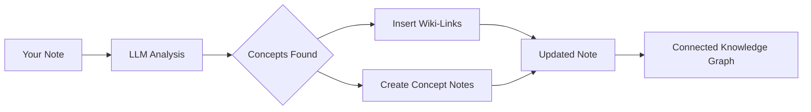

import TLDR from '@site/src/components/TLDR';

# 維基連結

<TLDR>
**Notemd**會自動在您筆記中的關鍵概念後加上`[[wiki-links]]`。LLM會讀取您的內容，辨別上下文中的重要詞彙，並在每個出現的位置插入 Obsidian 風格的維基連結。亦可選擇建立帶有反向連結的概念筆記檔案。它支援同義詞過濾、重新命名或刪除時的連結完整性保護，以及純粹的提取模式（不修改檔案）。與僅能匹配現有筆記標題的 Auto Link 不同，Notemd運用 AI 來辨別新概念並建立相對應的筆記。此功能屬於[Obsidian AI知識管理指南](/docs/pillar-ai-knowledge)的一部分。
</TLDR>

## 概覽

維基連結是 Notemd 的核心功能。它透過以下方式將純文字轉換為相互連結的知識圖譜：

1. 使用 LLM **分析您的筆記**
2. **辨別關鍵概念**（術語、人物、方法、理論）
3. 在每個出現的位置插入 `[[wiki-links]]`
4. **建立概念說明**（可選）並附上反向連結

## 它的運作原理是什麼

### 處理



### 範例

**之前：**
```markdown
Machine learning models use neural networks to learn patterns from data.
The transformer architecture revolutionized natural language processing.
```

**之後：**
```markdown
[[Machine learning]] models use [[neural networks]] to learn patterns from data.
The [[transformer architecture]] revolutionized [[natural language processing]].
```

## 使用方式

### 基本：新增連結至目前筆記

1. 打開筆記
2. 在編輯器中按右鍵 → **「處理檔案（新增連結）」**
3. 請稍等幾秒鐘。
4. 概念現在已經連結了！

### 批次處理：同時處理多個筆記

1. 在檔案總管中按右鍵選取資料夾
2. 選擇 **"Notemd: 處理資料夾（新增連結）"**
3. 設定：
   - 同時執行數（可平行處理的檔案數量）
   - 覆寫現有連結（是/否）
4. 點擊 **Process**

### 選擇性：連結特定文字

1. 標出要處理的文字
2. 按右鍵 → **「處理選項（新增連結）」**
3. 僅分析高亮顯示的部分

## Notemd 與自動連結

Obsidian 有兩種自動建立維基連結的方法：

| | **自動連結** | **Notemd** |
|--|---------------|-------------|
| 連結來源 | 金庫中現有的筆記標題 | LLM-內容中辨識出的概念 |
| 能否連結新概念 | 不行——標題必須已經存在。 | 是的——AI能辨別概念並建立筆記 |
| 同義詞處理 | 沒有 | 是的 — 同義詞抑制 |
| 概念說明書的撰寫 | 沒有 | 是的——包含反向連結與去重處理 |
| 批次處理 | 否（單一檔案） | 是（資料夾層級） |
| 每任務模型路由 | 沒有 | 是的 |

**Auto Link** 是以標題為匹配依據的：如果存在名為「Machine Learning」的筆記，它會將其中的出現內容包裝在 `[[Machine Learning]]` 中。如果該筆記不存在，則不會有任何動作。

**Notemd** 是由人工智慧驅動的： LLM 會閱讀您的內容、理解上下文、辨別出應該建立連結的概念——即便目前還沒有相關筆記——並同時生成連結與概念筆記。

## 功能特性

### 同義詞抑制

**問題：** "transformer", "transformers", "Transformer architecture" → 3個不同的概念

**解決方案：** Notemd 可偵測近乎重複的內容，並使用標準化格式。

**設定：**
```
Settings → Advanced → Synonym Suppression
Threshold: 0.8 (0 = off, 1 = aggressive)
```

### 連結完整性

**當您重新命名概念說明時：**
- 所有維基連結都會自動更新（Obsidian 核心功能）
- 反向連結保持完整無損

**當您刪除概念說明時：**
- 連結仍然存在，但顯示為「未連結的提及」
- 你可以從任何出現的案例重新建立。

### 純粹提取模式

**在不修改原始內容的情況下提取概念：**

1. 按右鍵 → **「提取概念（不建立連結）」**
2. 概念說明書已建立
3. 原始檔案未受任何改動

使用場景：處理只讀內容或最終草稿。

## 概念說明書撰寫

### 自動建立

**當啟用時（預設值），Notemd 會建立：**

```markdown
---
tags: [concept, auto-generated]
created: 2026-06-13
source: [[Original Note Name]]
---

# Machine Learning

A branch of artificial intelligence that enables computers
to learn from data without explicit programming.

## Occurrences in Your Vault

- [[Original Note Name#Section]]
- [[Another Note#Header]]

## Related Concepts

- [[Neural Networks]]
- [[Deep Learning]]
- [[Supervised Learning]]
```

### 設定

**輸出資料夾：**
```
Settings → Output → Concept Folder
Default: concepts/
```

**階層結構：**
```
Settings → Output → Use Hierarchical Folders
If enabled:
  papers/my-paper.md → papers/concepts/Concept.md
If disabled:
  → concepts/Concept.md
```

**範本：**
```
Settings → Output → Concept Template
Customize with variables:
  {{concept}} — Concept name
  {{description}} — LLM-generated description
  {{backlinks}} — List of source notes
  {{date}} — Creation date
```

## 進階選項

### 上下文視窗

**要傳送多少周圍的文字：**

```
Settings → Linking → Context Window
Options: Sentence | Paragraph | Full Note
Default: Paragraph
```

尺寸越大 = 精確度越高，成本也越高。

### 最小出現次數

**僅連結出現多次的概念：**

```
Settings → Linking → Min Occurrences
Default: 1 (link all)
```

設定為 2 或 3，以聚焦於重複出現的主題。

### 排除模式

**跳過特定字詞：**

```
Settings → Linking → Exclude List
Example: note, idea, example, thing
```

防止過度連結一般術語。

### 自訂提示詞

**覆寫預設的 LLM 指令：**

```
Settings → Advanced → Custom Linking Prompt
Default:
  "Identify key concepts, theories, methods, and technical
   terms in the following text. Return as a list..."
```

根據特定領域的需求進行修改（例如：「聚焦醫學術語」）。

## 技巧與最佳實務

### ✅ 完成

- **處理字數超過 100 字的筆記** — 短篇筆記難以涵蓋完整概念
- **使用強大的模型**以實現更好的概念識別（GPT-4o、Claude）
- **接受前請審核** — 請確認建議的連結合乎邏輯
- **逐步建構** — 處理 5-10 個筆記，檢視圖表，調整設定

### ❌ 請勿

- **Over-link** — 并非每個名詞都需要連結
- **反複處理草稿** — 概念可能會改變，請等待其穩定後再進行。
- **忽略同義詞** — 啟用抑制功能，以避免出現「ML」與「Machine Learning」的差異

## 效能

### 速度

| 筆記本尺寸 | GPT-4o-mini | Claude Sonnet | Ollama（本地） |
|-----------|-------------|---------------|----------------|
| 500個字 | 2-3 秒 | 3-5 秒 | 5-10 秒 |
| 2000個字 | 5-8 秒 | 10-15 秒 | 20-40 秒 |
| 5000字以上 | 分塊處理（多次呼叫） | 分塊處理 | 分塊處理 |

### 成本估算

**範例：使用 GPT-4o-mini 撰寫的 1000 字筆記**
- 輸入：約 1500 個令牌
- 輸出結果：約 200 個令牌
- 成本：約 $0.001

**批次處理 100 個筆記：** 約 $0.10

## 故障排除

### 未添加任何連結

**檢查：**
1. LLM 呼叫成功（設定 → 診斷）
2. 備註內容已足夠（>50個字）
3. 概念是技術性/具體的（而非僅指代詞）

**嘗試：**
- 使用更強大的模型
- 增加上下文窗口大小
- 檢查 API 金鑰的有效性

### 連結過多

**解決方案：**
1. 增加最低出現次數（2或3次）
2. 將常見字眼加入排除清單中
3. 使用攻擊性較低的模型

### 錯誤的連結概念

**修正內容：**
1. 對於領域特定需求，請使用自訂提示詞。
2. 啟用同義詞抑制功能
3. 手動審核並解除連結

### 重命名後連結會斷開

**這是正常的 Obsidian 行為。**

要更新所有連結：
1. 將概念說明重新命名
2. Obsidian 會自動將 `[[old]]` 更新為 `[[new]]`

---

## 接下來的步驟

- 📖 [概念說明](./concept-notes) — 深入探討概念說明的撰寫方式
- 🔍 [研究整合](./research) — 將連結功能與網路研究相結合
- 🎨 [圖表](./diagrams) — 將您的知識圖譜視覺化
