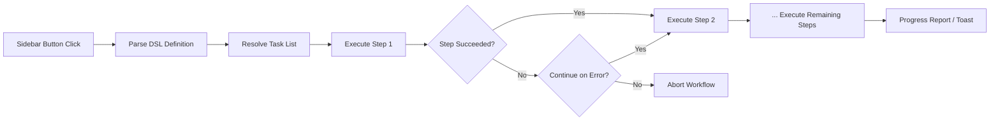

import TLDR from '@site/src/components/TLDR';

# 工作流程

<TLDR>
**Notemd 工作流能將多個任務串聯成單一的一鍵操作。** 可以使用簡單的 DSL 來定義如 `add-links > extract-concepts > research > diagram` 這樣的順序。工作流會以側邊欄按鈕的形式出現，於當前的筆記或資料夾上執行整個流程。系統已內建預定義的工作流；可在設定中建立自訂的工作流。每個步驟都使用其專屬的單任務模型設定。

這是[Obsidian AI知識管理指南](/docs/pillar-ai-knowledge)的一部分。
</TLDR>

## 概覽

工作流程能消除逐一執行任務時的阻礙。不必右鍵點擊四次來添加連結、提取概念、查詢不熟悉的術語以及產生圖表，只需按一下側邊欄的按鈕，整個流程就會自動執行。Notemd 會負責處理順序安排、錯誤傳播以及進度報告。

工作流程是以一種輕量級的 DSL（領域特定語言）來定義的。它們存在於設定中，會以可按下的按鈕形式出現在 Obsidian 左側邊欄中，且可以應用於目前的筆記或整個資料夾。

## 它的運作原理是什麼

### 工作流程執行管道



1. **Parse** -- DSL 字串會在 `>`（或 `>`）處被分割成一個有序的任務識別碼清單。
2. **Resolve** -- 每個識別碼都對應一個內部指令（add-links、extract-concepts、research、translate、diagram 等）。
3. **執行** -- 步驟會依序運行。每個步驟都會使用其配置的每任務供應商與模型。
4. **錯誤處理** -- 若某個步驟失敗，工作流程會根據您的錯誤處理策略，選擇中斷或繼續執行下一個步驟。
5. **完成** -- 一則提示通知會報告成功狀態，或列出任何失敗的步驟。

### DSL 格式

工作流程被定義為以 `>` 分隔的一系列任務識別碼：

```
process-current-add-links>extract-concepts-current>research-and-summarize
```

**可用的任務識別碼：**

| 識別碼 | 動作 |
|------------|--------|
| `process-current-add-links` | 在活躍筆記中加入維基連結 |
| `extract-concepts-current` | 從活躍筆記中提取概念 |
| `research-and-summarize` | 研究所選的文字或筆記標題 |
| `process-current-translate` | 翻譯活躍筆記 |
| `summarize-to-mermaid` | 根據目前的筆記生成圖表 |
| `generate-from-title` | 根據筆記標題產生內容 |
| `extract-original-text` | 提取原始文字（用於 OCR / 掃描內容） |

**資料夾層級變體**會在識別名中將 `current` 替換為 `folder`。

### 預定義工作流程與自訂工作流程

Notemd 隨附適用於常見模式的預製工作流程：

| 工作流程 | 鏈條 | 使用案例 |
|----------|-------|----------|
| **一次點擊提取** | add-links > extract-concepts > research | 一次處理完一篇研究論文 |
| **完整流程** | add-links > extract-concepts > research > 圖表 | 完整知識抽取並加以視覺化呈現 |
| **翻譯 + 連結** | 翻譯 > 添加連結 | 翻譯並在目標語言中連結相關概念 |

**自訂工作流程**是在設定中建立的：

1. 打開 **設定** --> **Notemd** --> **工作流程**
2. 點擊 **「新增工作流程」**
3. 輸入 DSL 連結串（例如：`process-current-add-links>extract-concepts-current`）
4. 為其指定顯示名稱（例如：「快速連結 + 提取」）
5. 新的按鈕會立即出現在側邊欄中。

## 設定

| 設定 | 預設值 | 效果 |
|---------|---------|--------|
| `workflows` | 預先定義的集合 | 工作流程定義的陣列（名稱 + DSL） |
| `workflowContinueOnError` | `true` | 如果當前步驟失敗，請繼續執行下一個步驟。 |
| `workflowShowProgress` | `true` | 在每個步驟完成後顯示進度提示。 |

### 工作流程中的任務專用模型

工作流程中的每個步驟都使用其**自己的**單一任務模型設定。您不需要在 DSL 內部指定模型。解析順序為：

1. 若 `useMultiModelSettings` 存在，則使用每任務的供應商/模型
2. 全球 `activeProvider`，否則

這表示 `add-links` 可以在 DeepSeek 上運行，而 `research` 則在 GPT-4o 上運行——所有操作都在同一個工作流程按鈕中完成。

## 範例

您剛剛將一篇機器學習論文的 PDF 整體匯入您的保險庫，並希望進行完整的知識抽取：

1. 打開已匯入的筆記
2. 點擊 **「完整流程」** 的側邊欄按鈕
3. Notemd 執行：
   - **步驟 1**：加入維基連結 -- `[[attention mechanism]]`、`[[transformer]]` 等。
   - **步驟 2**：提取概念 -- 在您的概念資料夾中建立概念筆記
   - **步驟 3**：資料搜集 -- 總結關鍵字對應的網路資源
   - **步驟 4**：圖表生成 -- 產生一篇論文的 Mermaid 思維導圖，呈現其結構
4. 大約 30 秒後，您的筆記將包含連結、概念說明已生成、研究內容已附加，且圖表檔案也會被儲存。

一切只需一次點擊。

## 技巧

- **從預定義的工作流程開始**——它們涵蓋了最常見的模式。只有在需要不同的順序時才進行自訂。
- **啟用 `workflowContinueOnError`** -- 當圖表製作過程中的某個步驟失敗時，不應中斷整個流程。
- **使用資料夾工作流程**進行大量處理——按一下資料夾右鍵，選擇一個工作流程，所有筆記都會被處理。
- **明確命名工作流程** -- 側邊欄的空間有限。請使用簡短且具行動指向性的名稱，例如「快速提取」或「翻譯 + 連結」。

---

## 接下來的步驟

- [研究](./research) -- 在將其加入工作流程之前，先了解研究步驟的功能
- [Wiki-Links](./wiki-links) -- 多數工作流程中使用的核心連結功能
- [概念說明](./concept-notes) -- 作為工作流程步驟的概念抽取
- [批次處理](/docs/advanced/batch-processing) -- 資料夾工作流程的併發處理與進度報告
