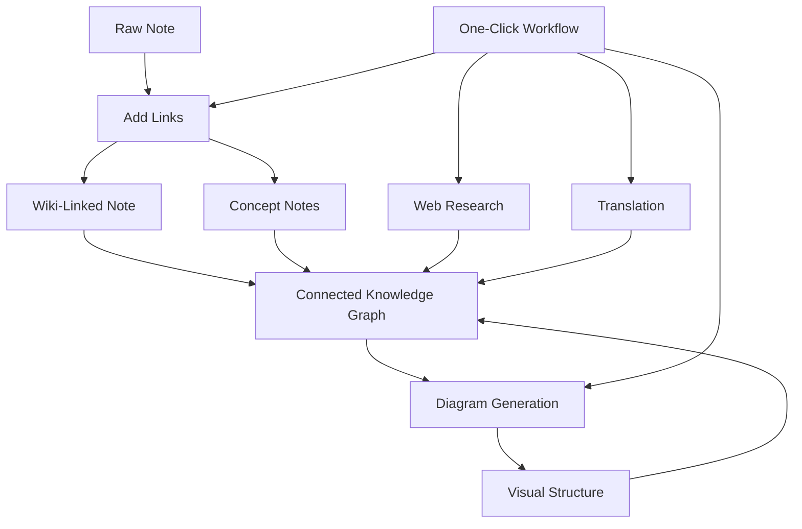

import TLDR from '@site/src/components/TLDR';

# Obsidian AI知識管理指南

<TLDR>
**Notemd 能將由 LLM 提供動力的閱讀內容轉化為持續性的知識：維基連結可串接各種概念，概念筆記能建立可搜尋的圖譜，研究功能可將網路上的資訊納入您的知識庫，翻譯功能可打破語言障礙，圖表則能讓結構一目了然，而工作流程則能讓所有功能僅透過一次點擊即可串聯起來。** 本指南將完整介紹從原始筆記到具有連結性、視覺化且多語言的知識庫的整個流程。
</TLDR>

## 為何選擇 AI 知識管理？

傳統的筆記方式會產生純文本檔案。即便有手動建立的維基連結，大多數筆記仍保持分離狀態。Notemd 利用 LLM 來自動化處理這些連結層：

- **LLMs 會讀取您的內容**，並辨別出重點——包括術語、方法、人物與理論。
- **連結會自動插入**在每個概念出現的位置，而非藏在「另請參見」中。
- **概念說明文件會以獨立的可取得檔案形式產生**
- **研究透過網路取得的背景資料來豐富筆記**
- **圖表讓結構一目了然** — 由相同內容所產生的思維導圖、流程圖與資料圖表

結果就是：一個會隨著您處理的每條筆記而不斷擴充的知識圖譜，而非只有在您想起要添加連結時才會更新。

## 完整的處理流程



每個步驟都是獨立的。可選擇使用其中一個或全部。最具影響力的順序為：**添加連結 → 概念說明 → 圖表**。

---

## 1. Wiki-連結：明確建立連接

維基連結是知識圖譜的支柱。Notemd 使用 LLM 來：

1. 讀取您的筆記內容（長文件會分割成多個區塊）
2. 辨別核心概念——優先考慮具體的技術術語，而非一般名詞
3. 在每個出現的位置插入 `[[wiki-links]]`
4. 抑制同義詞，如此一來「ML」和「Machine Learning」就不會產生不同的節點

### 何時使用

- **每則筆記超過 100 個字** — 字數較少的筆記所含概念較少
- **研究論文、技術文件、會議筆記** — 內含大量領域專有術語
- **在內容穩定之後** — 請勿反複處理草稿

### 關鍵設定

| 設定 | 推薦 | 為什麼 |
|---------|-----------|-----|
| `addLinksProvider` | DeepSeek 或 GPT-4o-mini | 低成本下仍具良好精確度 |
| 同義詞抑制 | 開啟 | 防止重複節點 |
| 上下文視窗 | 段落 | 精確度與成本的平衡 |

→ [Wiki-Links 深入探討](/docs/features/wiki-links)

---

## 2. 概念說明：可檢索的知識節點

維基連結可將概念以內聯方式串接起來，但概念筆記則能讓每個概念被獨立查詢。每個概念都會有自己的 `.md` 檔案：

```markdown
# Machine Learning

## Linked From
- [[My Research Notes]]
- [[Neural Networks Explained]]
```

### 提取流程

LLM 的提示語結構相當嚴謹：
- 轉換為單數形式
- 較偏好多字詞概念而非單字詞（例如使用「介電弛豫」而非「弛豫」）
- 跳過參考文獻/參考資料章節
- 以 `CONCEPT:` 行的形式輸出，以便進行確定性解析

概念會透過 `Set<string>` 在各個區塊之間去除重複。單個區塊出現的 LLM 錯誤不會中斷整個操作。

### 反向連結

啟用後，每個概念筆記都會追蹤有哪些來源筆記提到了它。Obsidian 的原生反向連結面板也會顯示反向連線。

### 去重

Notemd的4步去重引擎可偵測：
1. **完全匹配** — 不區分大小寫的檔名比對
2. **複數形式** — 「Models.md」與「Model.md」的差異
3. **符號標準化** — 「A-B.md」與「A B.md」的差異
4. **單字包含** — 當存在「Machine Learning.md」時，「ML.md」會被標記

### 關鍵設定

| 設定 | 推薦 | 為什麼 |
|---------|-----------|-----|
| `conceptNoteFolder` | `concepts/` 或 `🧠 concepts/` | 保持金庫井然有序 |
| `extractConceptsAddBacklink` | 開啟 | 啟用反向查詢 |
| `extractConceptsMinimalTemplate` | 關閉 | 包含「Linked From」的完整模板 |
| 每任務模型 | DeepSeek | 概念抽取不需要昂貴的模型。 |
| 同義詞抑制 | 開啟 | 相同的設定會同時影響連結與提取。 |

→ [概念說明深入解析](/docs/features/concept-notes)

---

## 3. 研究：將網路引入

Notemd 將網路搜尋整合到您的筆記工作流程中：

1. **查詢建構** — 您的筆記標題或選取內容會成為搜尋查詢
2. **網路搜尋** — Tavily（推薦，需 API 金鑰）或 DuckDuckGo（免費，無需金鑰）
3. **LLM 摘要功能** — 將搜尋結果簡化為相關的摘要
4. **新增到筆記** — 在游標位置或作為新章節加入摘要

### 何時使用

- 在處理新主題之前——先取得網路上下文
- 當概念說明需要補充內容時——進行研究後再添加連結
- 用於文獻回顧——對資料夾中的筆記進行批次研究

### 關鍵設定

| 設定 | 推薦 | 為什麼 |
|---------|-----------|-----|
| `researchProvider` | GPT-4o 或 Claude | 研究需要更高品質的摘要生成 |
| 搜尋服務 | Tavily | 更高的相關性，可設定的深度 |
| `maxResearchContentTokens` | 4000 | 深度與成本之間的平衡 |

→ [深入研究](/docs/features/research)

---

## 4. 翻譯：打破語言障礙

Notemd 會使用您所設定的 LLM 來翻譯筆記——而非專用的翻譯 API。這意味著：

- **情境感知式翻譯** — LLM 能理解整份文件，而非僅逐句翻譯
- **技術術語處理** — "gradient descent" 仍保持為「梯度下降」，而非「坡度向下」
- **批次支援** — 一次操作即可翻譯整個筆記資料夾
- **每任務模型** — 使用 Gemini Flash 進行翻譯（快速、便宜且支援多語言）

### 語言支援

Notemd 本身支援 21 種 UI 語言。翻譯目標語言可依任務進行設定。常見的語言組合包括：EN↔ZH、EN↔JA、EN↔KO、EN↔DE、EN↔FR、EN↔ES。

→ [翻譯深入解析](/docs/features/translation)

---

## 5. 圖表：讓結構顯現出來

Notemd的圖表處理流程是以規格為優先： LLM會產生結構化的 `DiagramSpec` JSON，接著轉換器會將其轉換為目標格式。這種方式比要求 LLM直接處理原始的 Mermaid 語法，能產出更可靠的輸出結果。

### 意圖偵測

Notemd 會根據內容判斷最適合的圖表類型：

- **帶有數字的表格** → 數據圖表 (Vega-Lite)
- **用戶端/伺服器術語** → 序列圖 (Mermaid)
- **實體/主鍵** → ER圖表 (Mermaid)
- **步驟/流程圖** → 流程圖 (Mermaid)
- **概念圖關鍵字** → JSON Canvas (Obsidian 本機)
- **預設** → 思維導圖 (Mermaid)

### 渲染鏈路

主要目標 → 替代方案 → 替代方案 → HTML。如果 Mermaid 的語法出錯，它會帶著錯誤內容向 LLM 重試一次，否則就退而使用最簡化的圖表。

### 關鍵設定

| 設定 | 推薦 | 為什麼 |
|---------|-----------|-----|
| `enableExperimentalDiagramPipeline` | 開啟 | 以規格為先，提升品質 |
| `experimentalDiagramCompatibilityMode` | `best-fit` | 每個意圖的本機目標 |
| `summarizeToMermaidProvider` | GPT-4o 或 Claude | 圖表規格需要空間推理能力 |
| `autoMermaidFixAfterGenerate` | 開啟 | 自動偵測 LLM 語法錯誤 |
| 本地知識增強 | 針對特定領域啟用 | 透過金庫上下文提升精確度 |

→ [圖表深入解析](/docs/features/diagrams)

---

## 6. 工作流程：一鍵自動化

工作流程可將多個任務串聯成一個側邊欄按鈕。其 DSL 格式為：

```
task1 | task2 | task3
```

範例：`addLinks` | 提取概念 | generateDiagram` — 一鍵將筆記從原始文字轉換為完全連接的視覺化知識節點。

### 推薦的工作流程

| 工作流程 | 鏈條 | 使用案例 |
|----------|-------|----------|
| 完整流程 | `addLinks \| extractConcepts \| generateDiagram` | 新筆記 |
| 先進行研究 | `research \| addLinks` | 不熟悉的話題 |
| 多語言支援 | `translate \| addLinks` | 多語言筆記 |
| 僅圖表 | `generateDiagram` | 快速視覺化 |

→ [工作流程深入探討](/docs/features/workflows)

---

## 7. LLM 提供商：從雲端到本地的 36 種選項

Notemd 支持 4 種傳輸類型下的 36 家供應商。關鍵群組：

- **國際雲端**：OpenAI、Anthropic、Google、Mistral、xAI
- **中國雲端**：DeepSeek、Qwen、Doubao、Moonshot、GLM、百度、SiliconFlow
- **網關**：OpenRouter、GitHub Models、Hugging Face、Vercel
- **本地**：Ollama、LMStudio、OVMS — 沒有 API 金鑰，資料不會離開您的電腦

### 每任務模型策略

最具成本效益的設定方式是，對於簡單任務使用便宜的模型，對於複雜任務則使用強大的模型：

```
extractConcepts  → DeepSeek (fast, cheap, accurate enough)
addLinks          → DeepSeek or GPT-4o-mini
research          → GPT-4o or Claude (needs quality)
generateDiagram   → GPT-4o or Claude (needs spatial reasoning)
translate         → Gemini Flash (fast, multilingual)
```

→ [LLM 提供商概覽](/docs/providers/overview)

---

## 入門檢查清單

1. **安裝 Notemd** — [Community Plugins](/docs/getting-started/installation)（建議使用）或手動安裝
2. **設定供應商** — DeepSeek（最簡單）、OpenAI，或 Ollama（免費）
3. **處理您的第一張筆記** — 右鍵點擊 → 「處理檔案（新增連結）」
4. **設定概念資料夾** — 設定 → Notemd → 输出 → 概念資料夾
5. **提取概念** — 在同一張筆記上執行「提取概念」指令
6. **產生圖表** — 執行「Generate diagram」以視覺化這些連線
7. **建立工作流程** — 將上述步驟串聯成一個按一下即可執行的按鈕

## 推薦的設定

### 學生（預算）

```
Provider: DeepSeek (free tier available)
Concept extraction: DeepSeek
Research: DuckDuckGo (free) + DeepSeek
Diagrams: Off (or legacy Mermaid)
Workflows: addLinks | extractConcepts
```

### 研究員（品質）

```
Provider: GPT-4o (primary)
Concept extraction: DeepSeek (cost savings)
Research: GPT-4o + Tavily
Diagrams: best-fit mode, GPT-4o
Workflows: research | addLinks | extractConcepts | generateDiagram
```

### 以隱私為首（僅限本地）

```
Provider: Ollama (llama3 or qwen2.5:7b)
All tasks: Ollama
Research: DuckDuckGo (free, no API key)
Diagrams: legacy Mermaid mode
```

### 雙語（ZH + EN）

```
Primary: DeepSeek (Chinese queries)
Translation: Google Gemini Flash
Research: Tavily + DeepSeek (Chinese search context)
Language output: per-task (extractConceptsLanguage: zh-CN)
```

---

## 常見模式

### 模式：處理一篇研究論文

1. 匯入 PDF 內容（或貼上）
2. **研究** — 取得該主題的網路相關資料
3. **新增連結** — 檢出並連結關鍵概念
4. **提取概念** — 建立獨立筆記
5. **產生圖表** — 可視化論文的結構

### 模式：每日筆記豐富化

1. 寫每日筆記
2. **新增連結** — 將今日的構想與現有的概念相連結
3. 概念說明會隨著反向連結自動更新

### 模式：文獻綜述

1. 建立名為 papers/notes 的資料夾
2. **批次新增連結** — 處理整個資料夾
3. **去除重複概念** — 清理幾乎重複的筆記
4. **產生圖表** — 整個文獻的思維導圖

---

*Notemd 是開源軟體（MIT 授權），且可在所有平台上與 Obsidian 0.15.0+ 一起使用。[立即安裝](/docs/getting-started/installation) 或 [在 GitHub 上查看](https://github.com/Jacobinwwey/obsidian-NotEMD)。*
