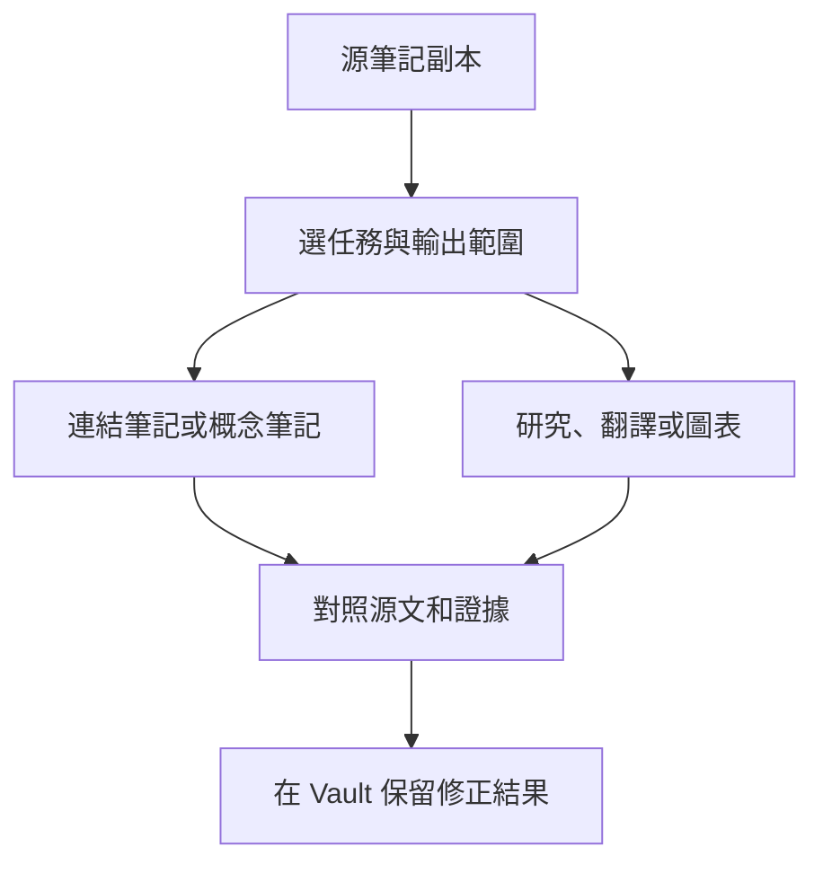

import TLDR from '@site/src/components/TLDR';

# Obsidian AI 知識管理指南

<TLDR>
有用的流程會區分源材料、模型生成與你的修正。Notemd 的連結、擷取、研究、翻譯與圖表任務寫入可審核檔案。先驗證一篇來源，再自動化有限資料夾。
</TLDR>

## 定義目標

先決定需要連結閱讀筆記、概念集合、有來源摘要、譯文還是圖表。更多檔案或連結不自動改善理解及檢索；先想好如何驗證及日後找到材料。

## 完整流程


```mermaid
flowchart TD
    A[源筆記副本] --> B[選任務與輸出範圍]
    B --> C[連結筆記或概念筆記]
    B --> D[研究、翻譯或圖表]
    C --> E[對照源文和證據]
    D --> E
    E --> F[在 Vault 保留修正結果]
```

這些是可選任務，不表示一個預設按鈕完成全部。保留源檔，組合工作流程前核對每項輸出位置。

## 1. Wiki 連結：明確建立關係

試跑 **處理檔案（新增連結）**，預設檢查同層 `_processed.md`。核對連結有無導覽價值，以及引文、程式碼、公式是否忠實。

聚焦學習和同義詞抑制可引導模型，不保證概念等價或數值閾值。重視按既有檔名可重現匹配時，使用確定性標題比對。

[Wiki 連結](./features/wiki-links)

## 2. 概念筆記：區分術語與說明

擷取前指定概念目錄。獨立擷取預設僅標題，源文不變；新檔需 `Linked From` 時開啟反向連結並關閉最小模板。

擷取與解釋生成是不同操作。**從標題批次生成** 可能處理目錄內既有及新增合格筆記。測試用專用目錄，核對 complete 移動行為。

重複審核依檔名啟發式，移除前確認，相近名稱可能代表不同技術概念。

[概念筆記](./features/concept-notes)

## 3. 研究：保留證據鏈

選主題或活動標題，在設定選 Tavily／DuckDuckGo，執行 **研究並摘要**。缺 Tavily key 不自動換 DuckDuckGo，打開來源核驗附加摘要。

選用本地檢索加入範圍內片段，其索引為詞法，片段傳至任務 LLM。本地索引不代表研究完全離線或只在裝置內。

[研究指南](./features/research)

## 4. 翻譯：核對意義與結構

選輸出語言，執行檔案翻譯。預設 `_<language>.md`，既有目標可覆寫。只需片段先複製至暫存筆記。

檢查術語、數字、程式碼、連結和數學符號。長文分塊可能失去上下文，21 個 UI 和 34 個網站 locale 不證明任何語言對品質。

[翻譯指南](./features/translation)

## 5. 圖表：選可編輯產物

一次勾選多種圖表，每種類型獨立選擇多種輸出格式。取消勾選仍保留該類型的格式偏好；全部取消則自動分析原文。 核取方塊控制是否產生該類型；按一下名稱會選取該類型並開啟其格式設定。滑鼠停留或鍵盤聚焦會切換預覽，不儲存設定。Escape 關閉選單並返回焦點。

選擇受支援目錄。CircuitikZ 有受限輸出與獨立原生編譯檢查；Drawnix 靜態跨分支線不保證重排附著；PowerPoint 表格修復改善原生輸出，但 Mermaid／SVG 仍可圖片回退。

[圖表指南](./features/diagrams)

## 6. 工作流程：自動化已驗證步驟

以名稱、`::` 和 `>` 分隔動作 ID，預設：

```text
One-Click Extract::process-current-add-links>batch-generate-from-titles>batch-mermaid-fix
```

依序連結、目錄標題生成、Mermaid 修復，不增加通用研究或圖表生成。各動作保留先決條件與輸出，不是任意文字管線。

預設遇回報失敗停止，只有後續能用剩餘輸入才適合繼續。取消保留完成產物，不是回復。

[工作流程](./features/workflows)

## 7. Provider：匹配協定與工作負載

36 個預設涵蓋五類協定，依端點、存取權、資料政策及實測結果選擇。比較速度／費用採相同源文與提示詞。

任務專用路由預設關閉。明確需要不同 profile 時才啟用，判斷本地化前逐項檢查。

[Provider 概覽](./providers/overview)

## 開始使用清單

1. 安裝並備份源文。
2. 設定、測試精確 provider/model。
3. 指定概念目錄及獨立輸出。
4. 對副本執行一項任務。
5. 對照來源，保留更正。
6. 擴至小目錄，檢查部分完成後再組較長流程。

## 常見模式

### 處理研究論文

以外部工具轉為可讀 Markdown，先檢查公式、表格和圖片。擷取概念／原文，研究指定問題，只有有助於核對關係時才生成圖表。保留論文連結與更正。

### 維護概念集

用專用目錄，擷取後審核術語，只為選定子集生成解釋。去重前備份；數量無法取代精確定義和有效導覽。

### 處理私密材料

先裝妥本地服務、模型和依賴，檢查專用路由。離線需求時避開網路研究，分享前審核診斷。預設回環地址不阻止 profile 改為遠端。

### 復原中斷批次

等待取消／失敗收斂，閱讀報告、核對已完成和復原輸出、比較衝突，只重試預期工作。取消不等於無輸出，配套檔需先查引用再刪。

## 延伸閱讀

- [快速開始](./getting-started/quick-start)：首個任務。
- [批次處理](./advanced/batch-processing)：範圍與歸屬。
- [開發者](./developers/overview)：擴充和驗證。
- [Agent](./agents/overview)：公開契約。
