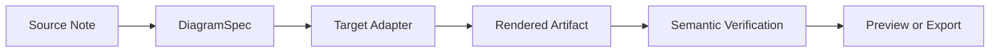
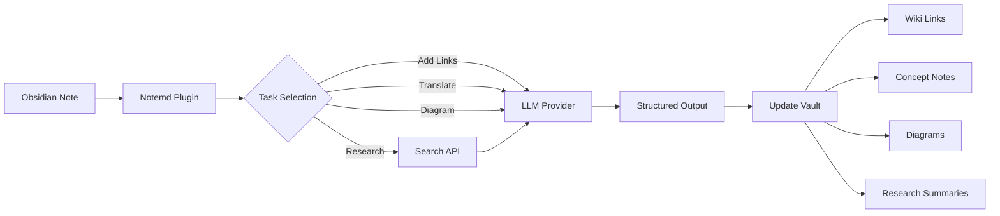

import TLDR from '@site/src/components/TLDR';

# Notemd 簡介

<TLDR>
**Notemd**（Note + EMD — Enhanced Markdown Documents）是一個開源的 Obsidian 外掛，能將以 LLM 為基礎的閱讀內容轉化為持續性的知識。與會話結束後洞察即消失的聊天式 AI 不同，Notemd 會將結果**直接寫入您的資料庫**，呈現為維基連結、概念筆記、研究摘要、翻譯內容、工作流程及圖表。它專為那些希望將閱讀、研究與視覺化說明累積成結構化且持續演進的知識圖譜的研究人員、學生及知識工作者所設計。
</TLDR>

## Notemd 是什麼？

Notemd 能將 **30 多個大型語言模型**（OpenAI、Anthropic、Google、DeepSeek、Qwen、Ollama 等）整合到您的 Obsidian 工作流程中，用於自動化知識提取、整理、翻譯、研究以及圖表生成。

### 關鍵差異：暫時性知識與持久性知識

| 面向 | 以聊天為基礎的 AI（ChatGPT 等） | Notemd |
|--------|-------------------------------|--------|
| **結果儲存位置** | 聊天記錄（會消失） | 您的 Obsidian 金庫（會持續存在） |
| **格式** | 純文字答案 | 結構化檔案：`[[wiki-links]]`、概念說明、圖表 |
| **長期價值** | 每次都必須重新詢問。 | 累積成為知識圖譜 |
| **離線存取** | 需要網際網路連線 | 可完全離線使用 Ollama |

## 核心功能

### 1. **自動維基連結功能**
- LLM 用來標示筆記中的重點概念
- 在每個出現的位置插入 `[[wiki-links]]`
- 可選擇建立連結的概念筆記
- 同義詞壓制以避免重複

### 2. **概念說明書的撰寫**
- 從論文、文章、筆記中提取核心概念
- 產生帶有反向連結的專用概念檔案
- 可自訂的輸出路徑與範本

### 3. **網路資料搜尋整合**
- 從 Obsidian 內查詢 Tavily 或 DuckDuckGo
- LLM 會附上出處引用來總結結果
- 將研究結果附加到目前的筆記中

### 4. **多語言翻譯**
- 翻譯選取的內容或整份筆記
- 支援 21 種以上 UI 語言
- 獨立輸出語言設定
- 批次翻譯支援

### 5. **圖表產生**
- **Mermaid**：流程圖、序列圖、類圖、狀態圖、ER圖、甘特圖
- **JSON Canvas**: Obsidian 原生佈局
- **Vega-Lite**：資料圖表、時間序列、散點圖
- **HTML / 可編輯 HTML/SVG**：具備語意標註的獨立圖形檔案
- **Draw.io / Drawnix artifact boundaries**：來自相同語意圖形模型的、供維護者使用的匯出路徑
- **電路圖規劃藍圖**： circuitikz/TikZJax 的支援功能正以黃金參考資料、限制條件提示、渲染回饋以及拓撲結構/佈局驗證為核心來設計，而非依賴未經限制的原始 LLM TikZ
- **預覽診斷**：渲染瑕疵可能會顯示編譯/渲染過程中的診斷資訊，且非內聯式來源亦可在不需插件端 LaTeX 執行環境的情況下被檢視。
- Mermaid 錯誤的語法自動修正

### 6. **一次點擊工作流程**
- 將多個動作串聯成側邊欄按鈕
- 以 DSL 為基礎的工作流程定義
- 範例：`add-links > extract-concepts > research > diagram`

## 誰適合使用 Notemd？

✅ **研究人員**正在閱讀論文並撰寫文獻綜述
✅ **學生**整理筆記並建立概念圖
✅ **需要讓閱讀心得持續保留的知識工作者**
✅ 需要翻譯及維基連結的**雙語專業人員**
✅ **重視隱私的使用者**，希望獲得本地的 LLM 支援 (Ollama)
✅ **高階使用者**，能自訂提示詞與工作流程

## 為什麼是 Notemd + Obsidian？

**Obsidian** 是一個以本地為主、基於 Markdown 的知識庫。**Notemd** 則增添了 AI 的強大功能：
- 您的資料會保存在您的保險庫中（而非雲端服務）。
- 可搭配本地模型離線運作
- 免費且開源（MIT 授權）
- 與現有的 Obsidian 外掛程式整合
- 可擴展至數萬個音符

## 入門指南

1. **安裝**：設定 → 社群外掛 → 瀏覽 → "Notemd"
2. **設定**：新增您的 LLM 提供商 API 金鑰（或使用本機的 Ollama）
3. **試試看**：打開筆記 → 右鍵點擊 → 「處理檔案（加入連結）」
4. **探索**：在側邊欄查看一次點擊即可完成的工作流程

👉 [安裝指南](./getting-started/installation) | [快速入門教學](./getting-started/quick-start)

## 圖表功能方向

Notemd的圖表處理方式正逐漸從「要求模型撰寫一個語法字串」，轉變為採用分層式處理流程：

目前的實作已經支援 Mermaid、JSON Canvas、Vega-Lite、HTML 的回退機制，可編輯的 HTML/SVG，Draw.io XML 的元件，最簡化的 Drawnix JSON 子集，預覽診斷/僅源碼模式回退，以及適用於常見來源與 CMOS 電路反相器的離線 `CircuitSpec -> circuitikz` 原型。電路圖則較為複雜：雖然 circuitikz 能夠呈現精確的電氣拓撲結構，但缺乏限制的 LLM 輸出往往會產生難以辨識的走線或無法渲染的 LaTeX 內容。未來的發展方向是透過黃金參考模板、節點網格佈局規則、渲染診斷功能以及截圖回饋循環，來持續限制 circuitikz 的行為。

請閱讀 [Diagrams](./features/diagrams) 中的詳細資料。

## 架構

## Notemd 與其他 Obsidian AI 外掛的比較

多數 Obsidian AI 外掛都是以對話為主（你提問，AI 回答，洞察都留在聊天中）。而 Notemd 則是**以撰寫為主**：AI 會處理你的筆記，並將結構化的結果直接寫入你的資料庫中。

| 功能特性 | Notemd | Copilot | Smart Connections | Text Generator |
|-----------|--------|---------|-------------------|-----------------|
| 自動維基連結插入 | 是的 | 沒有 | 沒有 | 沒有 |
| 概念說明書的撰寫 | 是（含反向連結 + 去重） | 沒有 | 沒有 | 沒有 |
| 圖表產生 | 是的 (Mermaid, Canvas, Vega-Lite, HTML, 可編輯的工件) | 沒有 | 沒有 | 沒有 |
| 網路資料搜尋整合 | 是的 (Tavily + DuckDuckGo) | 沒有 | 沒有 | 沒有 |
| 批次資料夾處理 | 是的 | 限量版 | 沒有 | 限量版 |
| 每任務模型路由 | 是（7個任務，獨立模型） | 沒有 | 沒有 | 沒有 |
| 一次點擊的工作流程鏈接 | 是（DSL） | 沒有 | 沒有 | 沒有 |
| 翻譯（批次） | 是的 | 沒有 | 沒有 | 沒有 |
| 與 vault 聊天 | 沒有 | 是的 | 沒有 | 沒有 |
| 語意相似度搜尋 | 沒有 | 沒有 | 是的 | 沒有 |
| 以模板為基礎的生成 | 沒有 | 沒有 | 沒有 | 是的 |
| LLM 提供商 | 36（雲端 + 閘道 + 本地） | 3-5 | 2-3 | 3-5 |
| 完全離線 | 是的 (Ollama) | 部分 | 部分 | 部分 |

**何時選擇 Notemd**：如果您希望 AI 建立持久的知識圖譜，而非僅僅針對您的筆記進行對話。

**何時選擇 Copilot**：如果您希望在 Obsidian 內部擁有一個對話式 AI 助手。

**何時選擇 Smart Connections**：如果您希望透過語意搜尋來發現筆記之間的既有關聯。

## 哲學

**Notemd** 認為人工智慧應該輔助人類的知識工作，而非取代它。此外掛程式：
- 讓您掌握控制權（在套用變更前先進行審核）
- 保留上下文（所有結果皆可回溯至原始資料）
- 尊重隱私（支援本地 LLM，無遠端監控）
- 具有高度可擴展性（開放 APIs、自訂工作流程）

<!-- notemd-acknowledgments -->
## 致謝與參考專案

Notemd 由獨立維護。感謝為專案設計決策提供啟發，或為其整合能力提供基礎的開源專案與社群。此處列出僅用於說明參考或互通關係，不表示背書、隸屬關係、內建程式碼，也不表示存在程式碼重用。

- **參考專案:** [cloudy-tech-diagrams-skill](https://github.com/cloudy-liu/cloudy-tech-diagrams-skill), [Drawnix](https://github.com/plait-board/drawnix), [diagrams.net / draw.io](https://www.diagrams.net/), [repo-saga](https://github.com/teee32/repo-saga).
- **開源基礎:** [Mermaid](https://github.com/mermaid-js/mermaid), [Vega-Lite](https://vega.github.io/vega-lite/), [Slidev](https://github.com/slidevjs/slidev), [CircuitikZ](https://github.com/circuitikz/circuitikz), [Tectonic](https://github.com/tectonic-typesetting/tectonic), [Docusaurus](https://docusaurus.io).
- 各專案均保留自己的授權條款；Notemd 採用 [MIT 授權](https://github.com/Jacobinwwey/obsidian-NotEMD/blob/main/LICENSE)。

## 開源

- **授權條款**：MIT
- **來源**：[github.com/Jacobinwwey/obsidian-NotEMD](https://github.com/Jacobinwwey/obsidian-NotEMD)
- **社群**：[Discord](https://discord.gg/qnGgsQ9W) | [GitHub Discussions](https://github.com/Jacobinwwey/obsidian-NotEMD/discussions)
- **貢獻**：歡迎提交 Pull Request，詳情請見 [CONTRIBUTING.md](https://github.com/Jacobinwwey/obsidian-NotEMD/blob/main/CONTRIBUTING.md)

---

**下一步**：[安裝 →](./getting-started/installation)
